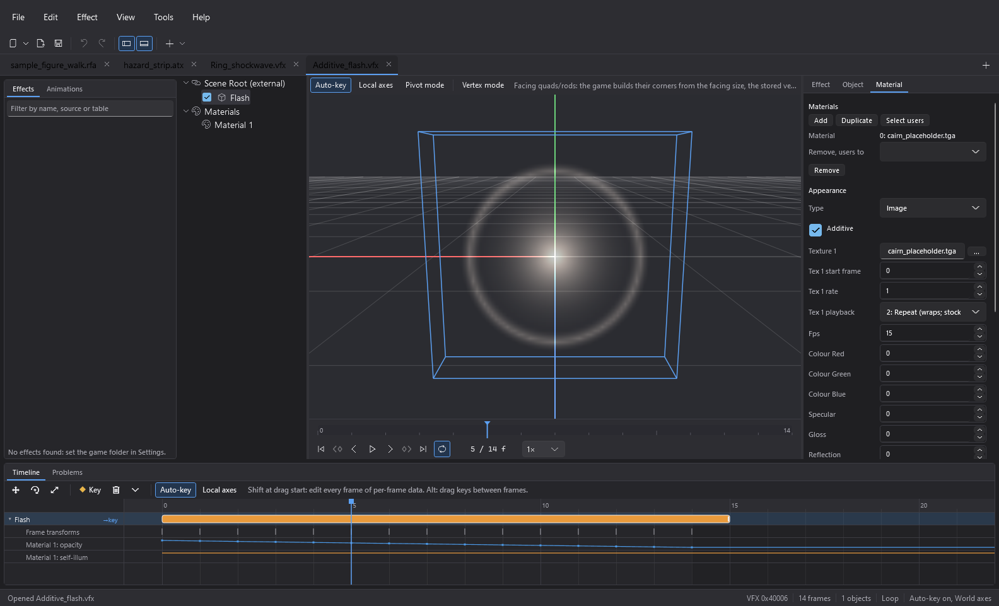
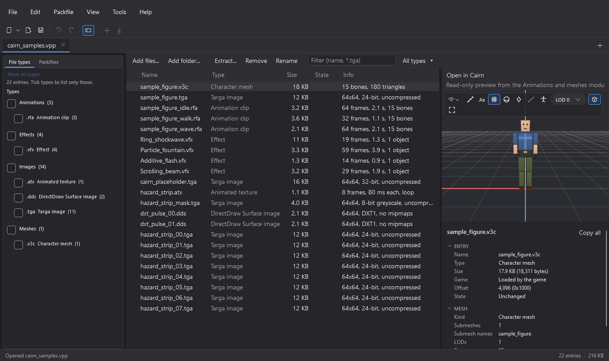
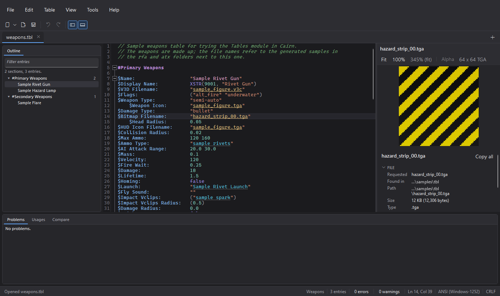

# Cairn usage guide

This guide is for Red Faction modders: texture artists, level designers, animators and effect artists. It explains
every part of Cairn: first how the window works, then one part per document type. Each part starts with task
walk-throughs for the common jobs and then gives the full reference, so you can read a walk-through end to end or
jump straight to the control you are looking at.

Cairn targets [Alpine Faction](https://alpinefaction.com) (1.0 to 1.5), the patch practically every Red Faction
player runs. Its checks follow how Alpine Faction loads files: what Alpine Faction reads is never reported as a
problem, and where a feature needs a particular Alpine Faction version and Cairn knows it, hover text and details
show it (for example "Alpine Faction 1.1+").



## Contents

- [The Cairn window](#the-cairn-window)
- [Animated textures (ATX)](#animated-textures-atx)
- [Animations and meshes (RFA, V3C, V3M)](#animations-and-meshes-rfa-v3c-v3m)
- [Effects (VFX)](#effects-vfx)
- [Packfiles (VPP)](#packfiles-vpp)
- [Tables (TBL)](#tables-tbl)

## The Cairn window

Cairn is one application with a module per kind of file. Every file you open becomes a tab, and tabs of any type sit
side by side: an animated texture, a clip, a character mesh, an effect and a table can all be open at once. The window
changes around the tab in front.

### Coming from ATX Workbench or RFA Workbench

On its first start Cairn imports the theme, game directory, search folders and recent files from ATX Workbench and
RFA Workbench, RFA Workbench's other preferences and its retarget profiles. The old apps' own files are only read,
never changed, so both keep working if you still have them installed. After that first start Cairn keeps its own
settings in `%APPDATA%\Cairn` and does not look at the old apps again.

What moved:

- **File › New** has one entry per document type (animated texture, clip, effect, and so on).
- The module menus appear only while a document of their type is in front: **Frames** for an animated texture,
  **Clip** for an animation clip, **Mesh** for a mesh, **Effect** for an effect, **Packfile** for a packfile,
  **Table** for a table. They sit between **Edit** and **View**.
- Importers and exporters from every module are under **File › Import** and **File › Export**.
- There is one settings dialog (**Tools › Settings…**) with a **General** page shared by all modules (theme, game
  directory, search folders) followed by one page per module.
- File associations are a page of the settings dialog, with a check box per file type (**Tools › Settings… ›
  File associations**); see [File associations](#file-associations).

### Layout

- **Menu, toolbar and status bar.** The status bar's right side shows facts about the document in front (for
  example its frame count or problem count); some entries can be clicked.
- **Tab strip.** One tab per open document. An asterisk marks unsaved changes; the tooltip shows the full path or,
  for a file opened from a `.vpp` archive, where it came from. Opening a file that is already open switches to its
  tab instead of opening it twice.
- **Left pane.** Belongs to the document in front: the **Animations** library for clips and meshes, the
  **Effects** library for effects, the **File types** panel and the **Packfiles** browser for a packfile, the
  **Outline** of sections and entries for a table, and nothing for an animated texture (the pane then hides). With
  no document open it shows every library, for browsing, with **Packfiles** first; the start page remembers the
  tab you chose last, separately from the documents' tabs. **Ctrl+Shift+L** shows or hides it.
- **Packfiles browser.** Every `.vpp` in the game folder, its `user_maps` folders, each folder of the game's `mods`
  folder that holds packfiles (only the files directly inside it) and your search folders, grouped by folder (hover
  a heading for the full folder path, a file for its full path) with its size. Each folder heading collapses and
  expands like the Animations library's skeleton families: click its arrow, double-click it, or select it and press
  **Left** or **Right**. Headings start expanded and keep your choice while Cairn runs; while the filter box has
  text, every matching heading shows expanded. The filter box matches file names and folder headings; the refresh button lists the folders again, and so does a change of the game folder or
  search folders in Settings. Double-click a packfile or press **Enter** to open it (an open one comes to the
  front); right-click for **Open**, **Show in Explorer** and **Copy path**.
- **Document area.** The view of the tab in front. With no tab open it shows the welcome view: recent files and
  buttons to create or open a document. A file you opened from inside a packfile (**Open in Cairn**) is listed as
  "packfile › file", with the packfile's folder beside it; clicking it opens the packfile and that file again. If
  the packfile or the file inside it is gone, Cairn says so and removes the item. Some documents add a pane on
  their right: a packfile's preview and details, a table's reference preview.
- **Bottom pane.** Panels for the document in front, such as a timeline or the Problems list. **Ctrl+Shift+M**
  shows or hides it. Pane sizes and visibility are remembered.

### Opening, saving and closing

- **Open.** **File › Open…** (**Ctrl+O**) accepts any type Cairn knows, several files at once. You can also drop
  files on the window, pass them on the command line, or double-click them in Explorer once associations are set.
  If Cairn is already running, a file opened from Explorer goes to the running window as a new tab.
- **Files from archives.** A file opened from inside a `.vpp` (from a library, for example) is read-only in place:
  **Save** asks where to write a copy, and no save ever defaults to the game directory. To change the files inside a
  packfile, open the packfile itself; see [Packfiles (VPP)](#packfiles-vpp).
- **Save** (**Ctrl+S**), **Save As…** (**Ctrl+Shift+S**) and **Save All** write through a temporary file, so a
  failed save never leaves a half-written file behind.
- **Close Tab** (**Ctrl+W** or **Ctrl+F4**) asks before discarding unsaved changes; closing the window lists every
  unsaved file. **Reopen Closed Tab** (**Ctrl+Shift+T**) brings back the last tab you closed, including unsaved
  changes.
- **Undo and redo** (**Ctrl+Z**, **Ctrl+Y** or **Ctrl+Shift+Z**) belong to each document; the Edit menu names the
  step they will undo or redo.

### Game folder and search folders

Cairn finds your Red Faction install on first run from Alpine Faction's (or Dash Faction's) settings. You can change
it, and add search folders of your own, under **Tools › Settings… › General**. All modules share this setting, so
textures, clips, meshes, tables and effects resolve the same way everywhere. Files are found by name, searching in
order:

1. the open file's own folder;
2. the search folders (loose files, then any `.vpp` inside them);
3. the Red Faction install: its root `.vpp` archives, then the `user_maps` folders.

### File associations

Choose **Tools › Settings…** and open the **File associations** page (**Tools › File Associations…** opens the
dialog straight at it). It has one row per file type Cairn opens, grouped by module and including `.vpp`
packfiles:

- **Type** and **Description**: the extension and what it is.
- **Opens now with**: the program Windows currently opens that type with (its tooltip says where Windows got it
  from).
- **Open with Cairn**: tick it to have that type open in Cairn when you double-click a file of it in Explorer;
  untick it to give the type back to the program Cairn replaced. **Select all** and **Select none** tick or untick
  every row.

Nothing changes until you press **OK**, and then only the rows you changed. Changes apply to your Windows account
only and need no administrator rights.

**When Windows asks you to confirm.** If you picked a default program for a type yourself in Windows (with
**Open with › Always**, or in Windows Settings), Windows protects that choice and does not let other programs
replace it. For such a row Cairn does not override your choice: it adds itself to the type's **Open with** list and
the row says so, with a **Choose default…** button that opens Windows' own chooser, where you can pick Cairn as the
default. If the chooser cannot be shown, use Windows Settings › Apps › Default apps instead.

**Older apps.** RFA Workbench and ATX Workbench registered `.rfa`, `.v3c` and `.atx` for themselves. **Remove old
RFA/ATX Workbench associations…** at the bottom of the page removes only what they registered for your account
(it asks first and acts at once).

### Recovery and crashes

Every 30 seconds Cairn keeps a copy of each document with unsaved changes in `%LOCALAPPDATA%\Cairn\recovery`. If
Cairn closes with unsaved work, the next start offers to restore it; restored documents open as unsaved tabs.
If something goes wrong, Cairn shows the details and writes them to `%LOCALAPPDATA%\Cairn\crash.log`.

### Files changed outside Cairn

When a file you have open changes on disk, its tab says so. With no unsaved changes of your own you can reload it;
with unsaved changes you choose between **Reload** (take the file on disk) and **Keep mine**. If the file is deleted
or moved, the tab says it is missing on disk and **Save** writes it back.

### Keyboard shortcuts

Shortcuts belong to a document type. A key such as **Space** or **Ctrl+T** can mean one thing in an animated texture
and another in a clip; the one that applies is always the one for the tab in front. Shortcuts without a modifier
key are ignored while you are typing in a text field. **Help › Keyboard Shortcuts** (**F1**) lists every shortcut,
grouped by document type.

### Where Cairn keeps its files

Settings in `%APPDATA%\Cairn\settings.json`, retarget profiles in `%APPDATA%\Cairn\profiles`, recovery copies, caches
and the crash log in `%LOCALAPPDATA%\Cairn`. Work copies of packfile entries go in `%LOCALAPPDATA%\Cairn\work` (or
the folder set on the Packfiles settings page) and are deleted when the packfile closes.

## Animated textures (ATX)

An `.atx` file is the declarative animated texture format of the [Alpine Faction](https://alpinefaction.com) patch
for Red Faction: a text file that lists frame images, their timing and options such as an alpha mask. Frames store
a bare file name, never a path; the images are found through the search order in
[Game folder and search folders](#game-folder-and-search-folders), with `user_maps\textures`, `user_maps\projects`,
`user_maps\single` and `user_maps\multi` searched in the game folder.

An animated texture tab has three parts that always agree: the **frames list** with thumbnails, the **preview**, and
the **source editor** with the `.atx` text. A change in any panel is written into the text as you watch, and anything
you type updates the panels. Comments and formatting are kept, and undo is one history across both. The Problems
panel sits inside the tab.

### ATX walk-throughs

#### Try the ATX samples

1. Open `samples/atx/hazard_strip.atx` (**File › Open…**). The preview plays the strip; the frames list shows its
   eight frames and the source editor its text.
2. Open `samples/atx/broken_example.atx`. The Problems panel lists what is wrong with it; each entry says what
   the game would do and how to fix it.

#### Make a new animated texture

1. Choose **File › New › Animated texture…**.
2. Add frames: **Frames › Add Frames › Browse…** (**Insert**) picks image files from disk; **Frames › Add Frames ›
   From VPP…** (**Ctrl+Shift+V**) picks images out of the game's `.vpp` archives with a preview;
   **Frames › Add Sequence…** detects a numbered run of images from any one of its files (**From files**) or makes
   the names from a pattern (**From pattern**).
3. Put the frames in order: drag them in the list, or use **Move Up** / **Move Down** (**Alt+Up** / **Alt+Down**),
   **Reverse Selection** and **Sort Selection by Name**.
4. Set the timing (see the next walk-through) and watch the preview.
5. Clear the Problems panel, then **File › Save** (**Ctrl+S**). Save the `.atx` next to its images, or make sure the
   images are somewhere on the search order.

#### Change the timing of many frames

1. Select the frames (**Ctrl+A** selects all of them).
2. Choose **Frames › Bulk Frame Timing…** (**Ctrl+T**).
3. Pick what to do: set, clear, scale, offset, distribute or ramp the timing. The dialog shows the timing before and
   after; **OK** applies it as one undo step.

For one frame, right-click it › **Edit frame time…**.

#### Convert an old animated VBM

1. Choose **File › Import › Import VBM...** (**Ctrl+Shift+I**) for a `.vbm` on disk, or **File › Import › Import VBM
   from VPP...** for one inside the game's archives.
2. Cairn writes the VBM's frames as images and opens a ready-to-use `.atx` that lists them. Check the timing and
   save it.

#### Fix a frame whose image cannot be found

The frames list marks the frame and the Problems panel names the missing file. Either put the image in the `.atx`
file's folder or a search folder, or select the frame and choose **Frames › Locate File…** to pick the image.

#### Check a texture for seams and alpha

Use the preview's 3×3 tiling to see whether the texture repeats without a visible seam, the alpha-only view to check
the alpha mask, and target-format simulation to see roughly what the game's texture format will do to the colours.

### ATX reference

**Frames list.** Thumbnails of every frame in order. Multi-select with **Ctrl** and **Shift**; drag to reorder.
Right-click: **Add Frames** (**Browse…**, **From VPP…**), **Rename…** (**F2**), **Edit frame time…**,
**Locate File…**, **Cut** / **Copy** / **Paste** (**Ctrl+X** / **Ctrl+C** / **Ctrl+V**, also in the Edit menu as
**Cut Frames**, **Copy Frames**, **Paste Frames**), **Duplicate** (**Ctrl+D**), **Remove** (**Del**),
**Move up** / **Move down**, **Reverse selection**, **Sort selection by name**.

**Frames menu.** **Add Frames** (**Browse…**, **From VPP…**), **Add Sequence…**, **Locate File…**, **Duplicate**,
**Remove**, **Move Up**, **Move Down**, **Reverse Selection**, **Sort Selection by Name**, **Select All Frames**,
**Bulk Frame Timing…**.

**Preview.** Plays the animation by the game's own playback rules with the alpha mask applied. **View › Play / Pause
Preview** (**Space**). Options: target-format simulation, 3×3 tiling for seam checks, alpha-only view.

**Source editor.** Syntax highlighting, completion, hover documentation for every keyword, find and replace
(**Edit › Find...**, **Ctrl+F**; **Edit › Find and Replace...**, **Ctrl+H**) and **Edit › Toggle Comment**
(**Ctrl+/**). **View › Focus Source Editor** (**Ctrl+E**) moves the keyboard focus to it. Right-click a problem in
the text for its quick fixes.

**Problems panel.** **View › Problems Panel** (**Ctrl+Shift+M**). Live checks against what the engine does: missing
images, frames that do not match frame 0, bad alpha masks, unknown tokens, names too long for the engine, and more.
Every entry says what is wrong and how to fix it; most have a one-click fix. A file with errors asks once before it
is saved.

**Help.** The built-in ATX format reference is in the Help menu.

### ATX troubleshooting and limitations

- **A frame shows as missing but the file exists.** Frames are found by name only. Check the spelling and that the
  file is in the `.atx` file's folder, a search folder, or one of the game folders listed above.
- **The preview differs from the game.** Target-format simulation approximates the game's texture conversion; the
  game is the final check.
- To ship the `.atx` and its images in a `.vpp`, see [Packfiles (VPP)](#packfiles-vpp). An animated texture in a
  packfile previews with frames from the same packfile, so you can check the set is complete before shipping it.

## Animations and meshes (RFA, V3C, V3M)

This part covers animation clips (`.rfa`), character meshes (`.v3c`) and static meshes (`.v3m`, read-only).

### Getting started

#### What Cairn is for

Red Faction animates its characters with two kinds of file:

- **Clips** (`.rfa`), each one animation: a walk, a reload, a death, a seated driver.
- **Character meshes** (`.v3c`), the models those clips play on, with their skeleton, collision spheres and prop
  points.

Cairn lets you watch any clip on any character exactly as the game plays it, edit clips key by key or by
posing bones in 3D, move a clip from one character's skeleton onto another's (retargeting), edit character
meshes, swap animations and meshes with Blender and other tools through glTF 2.0, and catch what the game would
get wrong before you load it. Static meshes (`.v3m`: items, props, level objects) open read-only so you can look
at them and check them.

What it does not do: it does not edit the game's tables (`entity.tbl`, `weapons.tbl`). It reads them, and it
writes ready-made table lines for you to paste; see [Get the result into the game](#get-the-result-into-the-game).
Packing files into a `.vpp` is the job of the [Packfiles](#packfiles-vpp) module.

#### What you need

- Windows and Cairn itself. The portable build needs nothing else.
- **Optional but recommended: a Red Faction install.** With it, the [library](#the-library) lists every stock clip
  and mesh, meshes show their textures, and the app knows from the game's tables which character plays which
  clip. Without it, everything still works on files you open yourself and on folders you add.
- The `samples\rfa` folder that comes with Cairn: a small made-up character with clean clips and one broken
  clip, so you can follow the walk-throughs without the game. See [Try it with the samples](#try-it-with-the-samples).

#### First run

On first start Cairn looks for your Red Faction folder: Alpine Faction's and Dash Faction's settings,
the registry entries of the retail, Steam and GOG versions, and the usual install paths. When it finds one, the
status bar says where (for example `Found Red Faction in <folder> (Found via Alpine
Faction's settings)`), and the library starts filling in. The very first library build reads every archive the game has
and can take a while on a slow disk; later starts use a cache and are quick.

If nothing is found, the library shows **Set game directory…** and **Add search folder…**. You can also set the
folder at any time under **Tools › Settings… › General** (see [Settings](#settings)).

#### The window at a glance

From top to bottom:

| Region | What it is |
|---|---|
| **Menu bar** | File, Edit, then **Clip** with a clip in front or **Mesh** with a mesh in front, View, Tools, Help. |
| **Toolbar** | **New** (a split button: the arrow lists every kind of file Cairn can create), Open, Save, Undo, Redo, the left-pane and bottom-pane toggles, then the active module's own buttons. The inspector is shown or hidden from the **View** menu. |
| **Tab strip** | One tab per open file (a star marks unsaved changes); the **+** button on the right opens a file. |
| **Animations** library (left pane) | Every clip and mesh Cairn can find. See [The library](#the-library). |
| **Viewport** (centre) | The 3D view with its own toolbar, the preview mesh or preview clip picker in its header, and the transport (play controls and time bar) underneath. See [The viewport](#the-viewport). |
| **Inspector** (right) | Tabs that show and edit the selected thing: **Clip**, **Bone** and **Key** for a clip, **Structure** for a mesh. See [The inspectors](#the-inspectors). |
| **Bottom panel** | Three tabs: **Timeline** (the dope sheet), **Problems** and **Table usage**. |
| **Status bar** | Error and warning counts (click to show Problems), messages, the bone count, the clip's duration, the playhead time and the playback speed. |

With no file open, the centre shows Cairn's welcome view (see [Layout](#layout)).

Panes are resized by dragging the splitters between them; the sizes are remembered.

#### Core concepts

**Clip.** One animation file (`.rfa`). It holds one *track* per bone of the character it is made for. The tables
spell clips `.mvf` (`ult2_walk.mvf` in a table is `ult2_walk.rfa` on disk).

**Mesh, skeleton, bone index.** A character mesh (`.v3c`, spelt `.vcm` in the tables) has a skeleton of up to 50
bones, each with a number, its *index*. A clip does not store bone names: track 0 drives bone 0, track 1 drives
bone 1, and so on. So a clip only plays correctly on a mesh with exactly the same number of bones in the same
order. Cairn shows bone names by borrowing them from the mesh you preview the clip on.

**Preview mesh / preview clip.** A clip tab plays its clip on a *preview mesh* you pick; a mesh tab plays a
*preview clip* you pick. Neither is saved into the file.

**Key, rotation key, position key.** Clips store poses at chosen moments, *keys*, and the game fills in between.
A *rotation key* says how a bone is turned relative to its parent; a *position key* says where the bone sits
relative to its parent (which sets the bone's length). Every bone needs position keys, or it collapses onto its
parent's joint.

**Tick, frame, start and end.** Clip time is counted in *ticks*, 4800 per second. Cairn shows *frames* of
160 ticks (30 per second) by default; stock clips start at frame 1 (tick 160). A clip plays from its *start*
time to its *end* time. Change the unit by clicking the time readout or in Settings.

**State and action.** The tables give each character named slots. A *state* is a base animation that loops
(stand, walk, run, crouch, seated in a jeep). An *action* is a one-off played on top (fire, reload, flinch, death).
States and actions use the same file format; they differ in how the game uses weights and ramps.

**Weight.** Every bone track has a weight from 0 to 10. When a clip plays as an action, a bone with weight 10
replaces the state completely on that bone, 5 shares it half and half, and 0 leaves it to the state. That is how
an upper-body reload plays over a walk: the arms are at 10, the legs at 0.

**Ramp in and ramp out.** When a clip plays as an action, its weights fade in from zero over the *ramp in* time
after the start, and fade out over the *ramp out* time before the end. States ignore ramps.

**Ease.** Each rotation key can *ease in* (arrive gently) and *ease out* (leave gently), from 0 % (linear) to
100 %.

**Control points.** Between two position keys the bone moves along a smooth curve; the two *control points* of
each key shape that curve.

**Bind pose and rest pose.** The *bind pose* is the pose the mesh's skin was attached to the skeleton in, stored
in the mesh. Retargeting talks about a *rest pose*: the pose each skeleton is measured from, ideally a T-pose.

**LOD (level of detail).** A mesh can hold up to three versions of its geometry, from most detailed (LOD 0) to
least; the game switches by camera distance.

**Prop point.** A named point on the mesh, usually following a bone, where the game attaches things: a held
weapon, a muzzle flash, a thruster.

**Collision sphere.** A named sphere following a bone, used for hit detection and collisions (`head`, `torso`…).
The tables refer to them by name.

**Morph data (vertex animation).** Some clips also move individual vertices of the one mesh they were made for,
mostly talking faces. It only fits that mesh; it plays on LOD 0 only.

**Retarget.** Transferring a clip from one skeleton onto a different one (another character type), keeping the
motion but giving it the target's proportions.

**IK (inverse kinematics).** Instead of turning the shoulder and elbow yourself, you say where the hand should be
and the arm bends to reach it. Cairn uses two-bone IK on arms (upper arm, forearm, hand) and legs (thigh,
shin, foot).

**Library, archives, search order.** The game's files live mostly inside `.vpp` archives. Cairn finds
clips, meshes, textures and tables by file name, searching the open file's own folder first, then your search
folders, then the game install. A clip from inside an archive opens read-only at its origin: saving asks where to
write a copy.

---

### Task walk-throughs

#### Try it with the samples

The `samples\rfa` folder holds a blocky 15-bone figure (`sample_figure.v3c`) with its texture, three clean clips
(`sample_figure_idle.rfa`, `sample_figure_walk.rfa`, `sample_figure_wave.rfa`) and a deliberately broken one
(`sample_figure_broken.rfa`). To use them:

1. Choose **Tools › Settings…**, and under **SEARCH FOLDERS** press **Add…** and pick the `samples\rfa` folder. Press
   **OK**. The library now lists the figure and its clips.
2. Open `sample_figure_walk.rfa` (**File › Open…**, or double-click it in the library's **Clips** tab).
3. In the viewport header, check that **Preview mesh** shows `sample_figure.v3c`. If another mesh with 15 bones
   was picked (the game may have one), choose `sample_figure.v3c` from that box. The app remembers your pick for
   this clip.
4. Press **Space** with the viewport focused (or the play button under it) to play.

The walk-throughs below use these files where they can. Retargeting needs two different skeletons, so those
walk-throughs use stock characters.

#### Look at a stock animation on a character

*You want to see how a stock clip moves, or which clips a character has.*

1. In the library, open the **Meshes** tab. Characters are grouped by *skeleton family*: meshes that share one
   skeleton, so any clip made for one plays on all of them (for example "miner family").
2. Double-click a character, for example `ult2_guard.v3c`. It opens in a tab posed in a suitable clip (one the
   tables give it, or a stand clip); the **Preview clip** box in the viewport header shows which. Press **Space**
   in the viewport to play it.
3. Expand the character in the library: under it are the clips the game's tables give it, grouped by class and
   table, each with its slot ("state stand", "action fire").
4. Double-click one of those clips. With a mesh tab in front, double-click *plays the clip on that mesh* instead
   of opening a new tab. The status bar confirms it.
5. Use the transport under the viewport to play, step frame by frame (**Left**/**Right**), or drag along the time
   bar.

To open a clip in a tab of its own instead (to edit it), **Ctrl+double-click** it, middle-click it, or
right-click › **Open in new tab**. A clip tab picks its own preview mesh: the one you picked for that clip before,
else one the tables play it on, else the mesh you last used for clips with that many bones, else any mesh with the
same bone count.

Useful while looking:
- The viewport toolbar toggles the skeleton, bone names, collision spheres, prop points and the root motion path;
  see [The viewport](#the-viewport).
- **Clip › Compare With…** plays a second clip as a ghost skeleton in step with this one.
- The **Table usage** tab lists every table line that plays the clip.

#### Fix or fine-tune a clip

Every edit is one step in the tab's undo history (**Ctrl+Z**, **Ctrl+Y**), and the **Edit** menu names the step
it will undo. Nothing is written to disk until you save. A file opened from inside a `.vpp` asks where to save a
copy.

##### Trim a clip to the part you need

*The clip has extra frames at the start or end you want gone.*

1. Open the clip. Optionally select keys in the timeline that span the part to keep.
2. Choose **Clip › Trim / Crop to Range…** (**Ctrl+Alt+T**).
3. Set **From** and **To**. They start at the selected keys' span (or the whole clip). **From playhead** and
   **To playhead** copy the playhead's time; **Whole clip** and **Selected keys** reset them.
4. Watch the viewport: it plays the trimmed result while the dialog is open, and a **Preview** badge appears in
   the viewport header. The **WHAT WILL CHANGE** box lists the new range and key counts.
5. Press **OK**.

Trimming adds a key at each end where the motion carries on past it, so what stays plays exactly as before. If
the ramps no longer fit the shorter clip, they are shortened together.

##### Make a clip faster or slower

1. Choose **Clip › Retime…** (**Ctrl+Alt+R**).
2. Either **Scale by** a percentage (200 % is twice as long, half the speed) or **Set length to** an exact
   duration.
3. Choose what stays put under **SCALE ABOUT**: **Start**, **Playhead** or **End**.
4. Press **OK**. Key values do not change, only their times (and the start, end and ramps). Keys that land on the
   same tick merge.

To move the whole clip in time without changing its speed, use **Clip › Shift in Time…** (**Ctrl+Alt+H**); its
**Start at 1 f** button moves the clip so it starts at frame 1, as stock clips do.

##### Clean up a pop

*A bone jumps at one moment, often at the end of a clip or where two halves were joined.*

1. Play the clip slowly: set the speed box in the transport to 0.25×, or step with **Left**/**Right**.
2. Find the bone. Click its joint in the viewport; its row comes into view in the timeline. Look at the
   **Problems** tab too: a pop is often a reported problem with a one-click fix (a lone rotation key, a segment
   the game snaps instead of turning, control points left at zero, a key outside the clip's range).
3. Pick the fix that suits the cause:
   - **A stray key**: click it in the timeline and press **Del**, or drag it to a better time.
   - **A key with the wrong pose**: double-click it to open it in the **Key** inspector and correct its rotation
     or position, or pose the bone in the viewport with auto-key on (see [Adjust a pose](#adjust-a-pose)).
   - **A sudden ease**: in the **Key** inspector, check **EASES**. A negative stored ease is not an ease at all
     but a jump; the inspector says so in orange. Set the ease to 0 %.
   - **The end does not match the start of a looping clip**: use **Make Loopable** (below).
   - **Many messy keys**: **Clip › Reduce Keys…** removes keys the motion does not need, or **Clip › Resample
     (Bake)…** replaces them with evenly spaced ones.
4. Keep the ghost of the saved clip on (viewport display menu › **Ghost of the saved clip**) to compare your edit
   with the version on disk.

##### Adjust a pose

*An elbow clips through the body, the head looks the wrong way, a hand misses the weapon.*

1. Make sure the clip plays on a fitting preview mesh (pose editing needs the bone names and hierarchy).
2. Click the joint of the bone to change in the viewport (**Ctrl+click** adds more bones).
3. Press **E** for the rotate tool (or **W** for the move tool, available for the root and for bones whose position
   is animated). Pick the axes in the space box next to the tools: **Local**, **Parent** or **Model**.
4. Decide how the change applies, with the **Key** toggle in the viewport toolbar:
   - **Auto-key on** (the default): the change is written as a key at the playhead, for the selected bones only.
     The motion elsewhere stays as it was. Use it to fix one moment.
   - **Auto-key off ("layer edit")**: the same change is added to *every* key of the bone, so the whole
     animation shifts. Use it to fix something that is wrong throughout, like a head tilted the whole time. The
     small arrow next to **Key** limits the change to a time range with a fade in and out.
5. Drag a ring (rotate) or an arrow (move). **Ctrl** snaps to 5° or 1 cm; **Esc** cancels the drag. Each drag is
   one undo step.
6. For hands and feet, turn on **IK**, choose the move tool and drag the hand or foot itself: the arm or leg bends
   to follow, the shoulder or hip stays put and the hand keeps its orientation. IK keys the three bones at the
   playhead, so it needs auto-key on.

A badge at the bottom left of the viewport always says what a drag will do ("Auto-key — keys hand-l at the
playhead (12 f)") or why there is no gizmo.

For an exact offset over a range, **Clip › Offset Bone…** (**Ctrl+Alt+F**) does the same as a layer edit with
typed numbers.

##### Make a clip loop

*A walk or idle hitches when it starts again.*

1. Choose **Clip › Make Loopable…**.
2. Under **BLEND**, choose **The end blends into the first pose** (the usual choice) or **The start blends out of
   the last pose**, and set the **Window**: how long the cross-fade lasts.
3. For a walk or run that travels, keep the root's travel on the axis it moves along (**Keep Z (forward)** is
   ticked for you when the root travels forward), so the character does not slide back.
4. The summary shows the *seam*, the largest jump from the last pose to the first, before and after. Press **OK**.

Make Loopable needs a preview mesh with the clip's bone count for the root travel options (it has to know which
bone is the root); the blend itself works without one.

#### Check a clip against how the game blends it

*An upper-body action looks right on its own but wrong in game over a walk; or a new action snaps in.*

The game plays an action on top of the current state using the action's bone weights and ramps. The **layered
preview** plays exactly that blend.

1. Open the action clip. With the samples, open `sample_figure_wave.rfa` (its arm bones have weight 10, the rest
   0, with 480-tick ramp in and 640-tick ramp out).
2. In the transport, press **Play as action over state**. Pick the state clip in the box next to it: the preview
   mesh's own table states come first, then every clip with the same bone count (pick `sample_figure_idle.rfa`).
3. Play. A badge over the viewport reads "Layered: this clip as an action over the state …". The ramps are the
   shaded ends of the time bar.
4. Adjust and watch:
   - Bones that should leave the state alone need weight 0; bones the action should own need 10. Change weights
     in the **Bone** inspector or with **Clip › Set Weights…**. The timeline shows each bone's weight at the right
     of its row.
   - If the action snaps in or out, lengthen **Ramp in** or **Ramp out** in the **Clip** inspector.

Only the preview changes; the clip is not touched. Clip tool previews also play layered while this is on.

#### Understand and clear the Problems list

*The status bar shows red or yellow counts and you want to know what they mean.*

Cairn checks the open file after every change against what the game actually does. Open
`sample_figure_broken.rfa` from the samples to see it:

1. Click the error or warning count in the status bar (or the **Problems** tab).
2. Each row says what is wrong, why it matters for the game, and how to fix it. The grey link names where it is
   ("Bone 5 (hand_l)", or a bone and a key time); click it to select that bone, jump to that time or focus that field.
3. Many rows have buttons: one-click fixes such as **Hold the rotation with a key at the start and the end** or
   **Set the ramps to 2400 in, 2400 out**. Each fix is one undo step.
4. The filter buttons at the top right show or hide errors, warnings and suggestions.

Errors mean the game will misbehave; warnings mean the file loads but probably not as intended; suggestions are
harmless tidy-ups. You can save a file with errors, but the app asks first. The full list of problems is in the
[Problems reference](#problems).

#### Give a character an animation it lacks

*Your character (say a female miner) needs a jeep-driving pose that only the male rig has; or your custom
character stands in the jeep seat.*

Clips only fit the skeleton they were made for. **Retarget** transfers one onto another skeleton: bone by bone,
matched by name, with the target's own proportions, while keeping what matters in place (hands on the wheel,
feet on the floor).

1. Open the clip to transfer (for example `park_jeep_driver.rfa`), playing on the mesh it was made for, and choose
   **Clip › Retarget…** (**Ctrl+R**). You can also right-click a clip in the library › **Retarget…**.
2. On the **Source & target** tab:
   - Check **CLIP TO RETARGET** (the active clip is chosen; any open tab or library clip can be picked).
   - Look at **KIND OF CLIP (PRESET)**. The app suggests one for the clip and says why ("Suggested for
     park_jeep_driver.rfa: Seated / fixed controls (the tables play it as the jeep_drive state)"). Which to pick:

     | Preset | Use it for | What it keeps in place |
     |---|---|---|
     | **Seated / fixed controls** | Drivers, gunners, turret operators: anything sitting with hands on controls. | Hips on the seat; hands and feet exactly where the source's were. |
     | **Standing / locomotion** | Standing, walking, running, crouching, jumping, dying, almost everything else. | The target's hips at its own height, feet on its own ground; arms swing as the source's; a two-handed weapon stays gripped. |
     | **Rotation only** | Swimming and anything with no contact with the ground or a control. | Nothing: every joint turns exactly as the source's, hands and feet land where the target's proportions put them. |

   - Under **TARGET RIG**, choose the **Target mesh** (the character that should get the clip). The **Rest mesh**,
     **Reference clip** and **Profile** fill in by themselves for the four stock humanoid rigs.
   - Under **OUTPUT**, check the **File name** (by default `af_{rig}_{clip}.rfa`, such as
     `af_female_jeep_driver.rfa`) and the **Save folder**.
3. Watch the preview on the right: the target mesh plays the result and a thin coloured skeleton plays the source
   in step. **Side by side** shows the source mesh next to it instead.
4. Check the **Bone map** tab if your target is not a stock rig: every target bone lists the source bone that
   drives it, and the status chip says whether that is fine. Errors there stop the retarget.
5. Read the **Report** tab:
   - **OUTPUT CHECKLIST**: the file is well-formed and has the target's bone count. Every line should be ticked.
   - **PINNED CONTACTS (WHAT IK HELD, WORST DISTANCE)**: how close each held hand or foot stayed to where it should
     be. It should be about 0 cm. More means the limb could not reach ("fully stretched").
   - **HANDS, FEET AND HEAD FROM THE SOURCE'S**: information, not errors. A shorter character's head sits lower,
     and so on.
   - **WHAT THE RETARGET DID**: notes and warnings, such as morph data being dropped.
6. Press **Retarget** to open the result in a new, unsaved tab previewed on the target mesh, where you can
   fine-tune it, or **Save as…** to write it straight away and open it.

The [Retarget reference](#retarget) explains every option.

#### Retarget a whole character's set in one go

*You built a new character type and want every clip the miner has.*

1. Choose **Tools › Batch Retarget…**.
2. On the **Rigs** tab, set the source and target meshes (the source defaults to the active clip's preview mesh,
   or `ult2_guard.v3c`).
3. On the **Clips & output** tab, leave the preset on **Automatic (per clip)**: each clip gets Seated, Rotation
   only or Standing / locomotion as the single dialog would suggest.
4. Fill the queue:
   - **Every clip the tables give** a class (pick it, for example `miner1`, and press **Add class**): every state,
     action and weapon-specific clip, once each. This is also what makes the table lines below match that class.
   - Or tick clips under **ADD CLIPS FROM THE LIBRARY** and press **Add checked**.
   - Or **Add files…** from disk.
5. Check the **QUEUE AND OUTPUT NAMES**: each clip's output name is shown, with a warning if it is longer than the
   game allows, already taken by another clip, or used twice in the batch. A quiet note marks names already in the
   output folder; the run asks once before replacing anything.
6. Set the output **Folder** and the **Name pattern**, then press **Run**. **Stop** stops after the clip in
   progress (what is done stays written).
7. When it finishes, the **RESULTS** list shows each clip's status, the preset used and its pinned contacts.
   Double-click a result to open it on the target mesh.
8. Press **Copy table lines**: `entity.tbl` lines giving the new clips the same states and actions as their
   sources, ready to paste into your new class. **Save report…** writes the results as Markdown or text.

#### Make a new animation

*Your character needs a motion no stock clip has: a new gesture, a taunt, a different idle.*

**Where to make it.** Cairn suits small and derivative work: a variant of a stock motion, a pose fix, an
edit that shifts a whole track, a short new gesture started with **File › New › Animation clip…**. It is also where every clip
gets its game-specific finishing, wherever the motion was made: weights and ramps, a layered preview over a state,
looping, key reduction, eases, the Problems list, a unique name and a table line. A substantial new motion is
better animated in Blender, because Cairn is not a full animation suite: it has no curve editor (eases are
per-key sliders and position control points are typed numbers), no onion skinning (one ghost clip at a time), no
constraints, and IK only on two-bone arms and legs. You can mix the two: block a motion out in Blender and finish
it here, or start a gesture here and send it to Blender when it outgrows the tools.

**(a) In Cairn**

1. Choose **File › New › Animation clip…** (**Ctrl+N**), or right-click the character in the library › **New Clip for This
   Mesh…**, or with its mesh tab in front **Mesh › New Clip for This Mesh…**.
2. Under **CHARACTER MESH**, check the mesh: the tab in front (or the preview mesh of the clip in front) is
   picked for you; **Browse…** takes a `.v3c` from disk.
3. Under **KIND AND LENGTH**, choose **State (loops)** or **Action (plays once)** and set the **Length**.
4. Under **STARTING POSE**, keep **A reference clip's pose**: the character's stand clip is picked for you (from
   the tables, or the stock rig's own stand clip), so the new clip carries the same bone lengths as the rest of the
   character's clips. **Pose at** chooses the moment of that clip to start from. Use **The mesh's bind pose** only
   when the character has no stand clip.
5. Check the **NAME** (a new name, at most 59 characters) and press **Create**. The clip opens as a new, unsaved
   tab on the mesh, with the Timeline in front and the playhead at the start. Every bone holds the starting pose
   with a key at the start and at the end.
6. Pose it: move the playhead (click the ruler, or **Left**/**Right**), click a joint, press **E** and drag a ring
   with **Key** on; each drag writes a key at the playhead. Use **W** with **IK** on to place a hand or foot. See
   [Adjust a pose](#adjust-a-pose) and [Pose editing](#pose-editing). **K** in the timeline keys the selected
   bones where they are, to hold a pose.
7. Shape the timing: drag keys in the [timeline](#the-timeline), and set eases in the **Key** inspector's
   **EASES**.
8. For a state, make the end meet the start with **Clip › Make Loopable…** (see
   [Make a clip loop](#make-a-clip-loop)). For an action, set the bone weights (**Bone** inspector, or **Clip ›
   Set Weights…**) and the **Ramp in** and **Ramp out** in the **Clip** inspector, then play it with **Play as
   action over state** (see [Check a clip against how the game blends it](#check-a-clip-against-how-the-game-blends-it)).
9. Clear the [Problems](#problems) tab, then **File › Save** (**Ctrl+S**): it asks where to write the new file.
10. In the **Table usage** tab, press **Copy table line** and paste it into your class (see
    [Get the result into the game](#get-the-result-into-the-game)).

**(b) Through Blender**

1. Open the character, or a related stock clip playing on it, and choose **File › Export › glTF…** (**Ctrl+E**).
   Under **ANIMATIONS**, tick a stock clip close to what you want as a reference (its stand clip at least). See
   [Send a clip or mesh out to Blender](#send-a-clip-or-mesh-out-to-blender).
2. In Blender, animate that armature. Keep its rest pose as it came in (pose bones; never move bones in Edit Mode)
   and keep the bone names: the clip takes its bone lengths from the animation, and every clip of a character must
   carry the same ones (problem RFA023 flags a clip that does not).
3. Export glTF 2.0 with the armature and its animation, then in Cairn choose **File › Import › Animation
   from glTF…** (**Ctrl+I**) with the character as the **TARGET MESH**. Set **Ramp in** and **Ramp out** under
   **OPTIONS** for an action. See [Bring an animation in from Blender](#bring-an-animation-in-from-blender).
4. Finish the imported tab as in steps 6 to 10 above: weights and ramps, the loop, **Clip › Reduce Keys…** for a
   densely baked motion, the Problems list, a new name and the table line.

#### Bring an animation in from Blender

*You animated in Blender and want an RF clip.*

1. In Blender, export glTF 2.0 (`.gltf` or `.glb`) with the armature and its animations. Name the armature's
   bones like the target character's. Names are matched exactly first, then with the stock rigs' naming rules,
   then by body part and side (`thigh_l` finds an upper-leg bone on the left); you can fix any pairing by hand in
   the bone map.
2. In Cairn choose **File › Import › Animation from glTF…** (**Ctrl+I**), or drop the file on the window
   (a file with both animations and meshes asks which to import).
3. Tick the **ANIMATIONS** to import; the selected one plays in the preview.
4. Choose the **TARGET MESH**: open tabs first, then library characters, or **Browse…** for a `.v3c`.
5. Check the **Bone map** tab: each bone of the target and the glTF node that drives it. Fix any row by picking
   another node.
6. Look at **OPTIONS**. They only matter when the file does not carry RF timing (an Cairn or REDUX export
   carries it): **Start at** (stock clips start at frame 1), **Bone weight** (10 is usual), **Ramp in**/**Ramp
   out** (for actions), **RFA version** (8), **Sample every** (for bones that must be resampled), **Reduce keys**,
   and the **Reference clip** whose first pose bones without a node hold.
7. Press **Import**. Each ticked animation opens as a new, unsaved clip tab on the target mesh. Check it, fix
   anything in the [Problems](#problems) tab, then save.

#### Send a clip or mesh out to Blender

1. Open the mesh, or a clip playing on the mesh you want.
2. Choose **File › Export › glTF…** (**Ctrl+E**).
3. Under **INCLUDE**, pick the LODs, collision spheres, prop points and **Textures (as PNG)**; or **Skeleton only
   (no geometry)**.
4. Under **ANIMATIONS**, tick other clips of the same rig to put in the same file (a clip export always includes
   itself).
5. Under **FORMAT**, pick **.gltf + .bin + PNG textures** (REDUX reads only this) or **Single .glb** (one file,
   fine for Blender).
6. Leave **Write RF key extras (rf_keys)** on so a clip comes back exactly if you import it again unchanged.
7. Choose the output path and press **Export**. The dialog stays open and lists what was written and any
   warnings.

Morph (vertex) animation is not exported; such clips export their bone animation with a warning.

#### Build or re-skin a character mesh from glTF

*You modelled a new character, or a new outfit for an existing skeleton.*

1. Choose **File › Import › Mesh from glTF…**.
2. Under **BUILD**, choose **Character (.v3c)** (skinned, with bones; clips play on it) or **Static mesh (.v3m)**.
3. To give an existing character new geometry but keep its skeleton, collision spheres and prop points (so all
   its clips keep working), open that character first, then tick **Replace the geometry but keep the skeleton,
   spheres and prop points of** and pick it.
4. Check **OPTIONS**: **Scale** (1; use 0.01 for a file in centimetres), **Texture names** (renaming to `.tga` is
   recommended; the game still finds a PNG of the same name first) and the LOD distances.
5. Read the **PRE-FLIGHT** list: every limit the result would break, everything converted or assumed, each with a
   fix hint. Errors disable **Import**.
6. Press **Import**: the mesh opens as a new, unsaved tab. Save it.

Name LOD objects `_LOD0`, `_LOD1`, `_LOD2` in Blender to control the levels of detail. Collision spheres and prop
points come from nodes named `rf_csphere::name` and `rf_prop::name` under their bones (REDUX's convention).

#### Rig a new mesh to an existing skeleton

*You modelled a new character or outfit and want it to play every clip a stock character already has.*

Rigging here means giving every vertex of your mesh its bone weights: how strongly each bone pulls it. That happens
in Blender, not in Cairn, which has no modelling or weight painting. Cairn gives Blender the
skeleton to rig against and takes the result back onto the very same skeleton, so every clip made for that
skeleton plays on your mesh unchanged.

1. **Export the skeleton.** In Cairn, open a character that uses the skeleton you want and choose **File ›
   Export to glTF…** (**Ctrl+E**). Prefer a character whose bind pose is a T-pose (arms out), which is far easier to
   fit and weight: `merc_grunt.v3c` rather than `merc_com.v3c`, `ult2_guard.v3c` rather than `riot_guard.v3c`
   (their binds have the arms down). Under **ANIMATIONS**, tick a clip or two (its stand clip, a walk) if you want
   to check the deformation in Blender. **Single .glb** is fine for Blender. See
   [Send a clip or mesh out to Blender](#send-a-clip-or-mesh-out-to-blender).
2. **Fit and weight the mesh in Blender.** Import the file, move, rotate and scale your mesh until it sits over the
   armature in its rest pose, apply the mesh's transforms, parent it to the armature (for example **With Automatic
   Weights**), then paint the weights until the joints bend well. Delete the stock mesh, or keep it out of the
   export.
3. **Export glTF 2.0** with your mesh and the armature (skinning on).
4. **Import onto the skeleton.** In Cairn, open the same character (`.v3c`) in a tab, then choose **File ›
   Import › Mesh from glTF…**, choose **Character (.v3c)**, tick **Replace the geometry but keep the skeleton, spheres
   and prop points of** and pick that character. Read the **PRE-FLIGHT** list (below) and press **Import**: your
   mesh opens as a new, unsaved tab with the character's bones, collision spheres and prop points. See
   [Build or re-skin a character mesh from glTF](#build-or-re-skin-a-character-mesh-from-gltf).
5. **Check it with stock clips.** With the new tab in front, double-click the character's clips in the library
   (expand the character under **Meshes**): each plays on your mesh. Look at elbows, shoulders, knees and the neck
   in a walk, a run and a crouch; fix the weights in Blender and import again where the skin tears or folds.
6. **Finish the mesh** in the **Structure** tab: move or resize the collision spheres to fit the new shape, move the
   prop points where the hands hold things, check the material textures and the LOD distances. See
   [Edit a mesh's skeleton, spheres, prop points, materials and LODs](#edit-a-meshs-skeleton-spheres-prop-points-materials-and-lods).
7. **Save** (**Ctrl+S**) under a new file name, and point your class's `$V3D Filename:` at it (spelt `.vcm` in the
   tables).

**The rules on the Blender side, and why.**
- **Do not change the armature's rest pose.** Move the mesh to fit the skeleton, never the bones in Edit Mode, and
  keep the armature at the scale it came in (apply scale on the mesh, not the armature). The importer keeps the
  existing mesh's stored bind pose for every bone and takes your vertices exactly as they are, so a bone you moved
  in Blender is not moved in the game: the skin would no longer sit where the weights expect, and it distorts in
  every clip. If your file is in centimetres, use **Scale** 0.01 in the import dialog rather than scaling objects.
- **Do not add, rename or delete bones.** Joints are matched to the kept bones by name (the `__rfbi` number the
  export adds to each name may stay). A joint that matches no bone is reported as MI011, and the vertices weighted to
  it go to its nearest matched parent. A genuinely new bone means a new skeleton, and no stock clip fits a new
  skeleton: clips address bones by their index, so they would play their tracks on the wrong bones.
- **Weight every vertex.** A vertex with no weights (MI006) is bound wholly to one bone (the mesh object's parent
  bone, or the root) and will not bend.
- **At most 4 bones per vertex.** The format stores 4; more (MI007) are cut to the 4 strongest. In Blender, limit
  them yourself (**Weights › Limit Total**, 4) so you choose what goes.
- **Levels of detail.** Name the objects `name_LOD0`, `name_LOD1`, `name_LOD2`: at most 3 LODs (MI003), each with at
  most 7 textures (MI004). Objects with the same name before `_LOD` form one submesh.
- **Name lengths.** Submesh (object) names hold 23 characters, texture names 31, in plain Latin letters (MI002;
  the import refuses longer ones).
- **Textures are names, not files.** The mesh stores only each material's texture file name (taken from the image
  file name in Blender, without its folder); **Name them .tga** stores it as `.tga`, and the game also finds a
  `.png` or `.dds` of the same name. The game must be able to find that file, so package the textures with your mod.

#### Edit a mesh's skeleton, spheres, prop points, materials and LODs

Open a `.v3c` and use the inspector's **Structure** tab. Select a node in the tree (or click a joint, a collision
sphere or a prop point in the viewport) and edit it in the pane below the tree, or drag it in the viewport with
the move (**W**) and rotate (**E**) tools.

- **Collision sphere too small or in the wrong place**: turn on collision spheres in the viewport toolbar and
  click the sphere (or select it under **Collision spheres**). With the move tool (**W**), drag the arrows to place
  it and drag its outline (or the round grip on it) to change the radius; or type **CENTRE** and **Radius** in
  the pane. Change **Bone** in the pane.
- **New hit sphere**: select a bone, choose **Mesh › Add Collision Sphere**. Name it as the tables expect.
- **Weapon held in the wrong spot**: turn on prop points in the viewport toolbar, click the prop point, and drag
  it with the move (**W**) and rotate (**E**) tools; or type its **POSITION** and **ORIENTATION**. Prop points are
  stored per LOD; edits apply to every LOD. Pick a preview clip that holds the weapon pose to see it where it
  matters: the prop point follows its bone, so you can place it in that pose.
- **A joint sits in the wrong place in the rest pose**: click the joint and drag it with the move or rotate
  tool. The viewport shows the bind pose while you do (see
  [Moving things in the viewport](#moving-things-in-the-viewport)); **Children** on the toolbar decides whether the
  bones below come along.
- **Wrong texture**: select the material under **Materials**, type a **Texture** name or press **Browse…** to pick
  from every texture the game and your folders provide.
- **LOD switches too early**: select the LOD and change its **Distance**.
- **Bone named wrong, or hangs off the wrong parent**: select the bone, change **Name** or **Parent**.
- **Bones in the wrong order**: **Mesh › Reorder Bones…**. Read the warning first: clips address bones by index,
  so every clip made for this mesh needs conforming afterwards. The dialog offers to conform the open clip tabs
  that preview this mesh in the same action.

Details are in [Mesh editing](#mesh-editing).

#### Get the result into the game

Cairn writes `.rfa`, `.v3c` and `.v3m` files and gives you table lines. Getting them into the game is up
to your usual mod packaging. What matters:

1. **Name the clip uniquely.** The game knows a clip by its base file name only, across the whole game, whatever
   folder or archive it is in. Two different files called `walk.rfa` cannot both be loaded: the first one found
   wins. A clip that shares a stock clip's name either replaces the stock clip everywhere or is never loaded,
   depending on which the game finds first. The app warns about this (problem RFA024); give new clips new names
   unless replacing a stock clip is the point.
2. **Keep the name to 59 characters** including `.rfa`. The game copies clip names into a small buffer; a longer
   name can crash it (RFA014).
3. **Match the bone count.** A clip must have exactly the bones of every mesh it plays on, in the same order
   (RFA002, RFA013).
4. **Add table lines.** The game only plays clips a table names. Use **Copy table line** in the
   [Table usage](#table-usage) tab, or **Copy table lines** after a batch retarget. Lines come out in the stock
   layout, clips spelt `.mvf`, for example:

   ```
   	+State:                 "stand"                 "af_female_stand.mvf"
   ```

   Paste them into the class block in your mod's copy of `entity.tbl` (or `weapons.tbl`). Remember the tables'
   spellings: `.mvf` is `.rfa`, `.vcm` is `.v3c`, `.v3d` is `.v3m`.
5. **Put the files where the game looks**: package them with your mod or level, for example in a `.vpp` made with
   Cairn's [Packfiles](#packfiles-vpp) module (**File › New › Packfile…**). Avoid dropping loose files
   into the game folder itself: a loose file there changes what the game loads for every level, which is why the
   app never offers the game folder as a save location.
6. **Clear the errors first.** Open each file and check the Problems tab shows no errors.

---

### Reference

#### Documents and tabs

**Opening files.** **File › Open…** (**Ctrl+O**, or the **+** at the end of the tab strip) opens `.rfa`, `.v3c`
and `.v3m` files, several at once. You can also drop files on the window, open them from the library, use
**File › Open Recent**, double-click them in Explorer once the [file association](#file-safety) is set, or pass
them on the command line. Opening or dropping a `.gltf` or `.glb` starts a glTF import instead (the Open dialog
lists them with the clips and meshes, and on their own under **glTF to import**). **File › Clear Recent Files**
empties the recent list.

**New clip.** **File › New › Animation clip…** (**Ctrl+N** with a clip or mesh tab in front, or the welcome view)
starts a clip from nothing for a character mesh; **Mesh › New Clip for This Mesh…** and the library's right-click
**New Clip for This Mesh…** start it for that mesh. Every bone holds a starting pose, keyed at the start and the
end, ready to pose (a walk-through is in [Make a new animation](#make-a-new-animation)). The dialog:

| Section | Options |
|---|---|
| CHARACTER MESH | The mesh the clip is made for, which fixes its bones and their order: open tabs first (the tab in front, a clip tab's preview mesh), then the library's characters; a filter; **Browse…** for a `.v3c`. Default: the mesh tab in front, else the preview mesh of the clip in front, else the mesh of your last new clip. |
| KIND AND LENGTH | **State (loops)**: no ramps (the game ignores them on states). **Action (plays once)**: ramps of 3 frames in and out, the most common stock action ramps. **Length** in your time unit, with the same length in frames, seconds and ticks under it. |
| STARTING POSE | **A reference clip's pose (usually the character's stand clip)**: a clip with the mesh's bone count, and **Pose at**, the moment of that clip to take (its start by default). The default is the stand state the tables give a class using the mesh, else the stock rig's own stand clip; a line under the list says which. Starting from it gives the new clip the bone lengths every other clip of the character carries. **The mesh's bind pose**: the default when no stand clip is known; it carries the bone lengths stored in the mesh, which can differ from the character's clips by a few centimetres. |
| Advanced | **RFA version** (**8** or **7**), **Bone weight** (10), **Ramp in** and **Ramp out** (set by the kind), **Start at** (frame 1). |
| NAME | The new clip's file name, checked as you type: not empty, characters the game can load, at most 59 characters with `.rfa`, and not the name of a clip the game already has. |

The preview on the right shows the starting pose on the mesh. **Create** opens the clip as a new, unsaved tab
previewed on the mesh, with the Timeline in front and the playhead at the start; the status bar says what to do
next. **Save** asks where to write it (never the game folder). **Cancel** (**Esc**).

**Kinds of tab.**
- A **clip tab** (`.rfa`) has the **Preview mesh** picker in the viewport header, the transport, the **Clip**,
  **Bone** and **Key** inspector tabs, and uses the **Timeline**.
- A **mesh tab** (`.v3c`) has the **Preview clip** picker (with a **Bind pose** entry for no clip) and the
  **Structure** inspector tab. You can watch clips on it but not edit them there; open the clip in its own tab to
  edit it.
- A **static mesh tab** (`.v3m`) opens read-only, with a note saying so, and has no transport. You can view it,
  read its structure and problems, and **Save As** a copy.

**The preview mesh picker** (clip tabs) lists the meshes the tables play the clip on first ("tables"), then meshes
with the same bone count, then the rest marked "does not fit". **Clip › Choose Preview Mesh…** opens it. Your
choice is remembered for that clip. If the bone counts differ, the viewport says so: the game would play the clip
wrong on that mesh, and the preview shows it the same way.

**The preview clip picker** (mesh tabs) lists **Bind pose**, then the tables' clips for this mesh, then every clip
with the same bone count. **Mesh › Choose Preview Clip…** opens it (it needs a mesh tab with bones in front).

**Tabs.** **Ctrl+Tab** and **Ctrl+Shift+Tab** switch tabs. **File › Close Tab** (**Ctrl+W**), the tab's ✕ or a
middle-click closes one, asking about unsaved changes. **File › Close All Tabs** closes every tab, asking once
about unsaved work. **File › Reopen Closed Tab** (**Ctrl+Shift+T**) brings back the last closed tab, with any
unsaved work it had. **File › Exit** (**Alt+F4**) closes the app. The tab's tooltip says where the file came from.

**Banners** at the top of a tab:
- "This file changed on disk while you were editing it." with **Reload** (throw away your changes) and
  **Keep mine**.
- "The file this tab came from was deleted or renamed on disk." with **Keep editing**.
- For a file from an archive: which `.vpp` it came from, and that Save asks where to write a copy.
- For a `.v3m`: that static meshes open read-only.

**Saving.** **File › Save** (**Ctrl+S**), **Save As…** (**Ctrl+Shift+S**), **Save All** (**Ctrl+Alt+S**). See
[File safety](#file-safety) for the rules.

**Edit menu.**
- **Undo** (**Ctrl+Z**) and **Redo** (**Ctrl+Y**, or **Ctrl+Shift+Z**) name the step they act on ("Undo Set ramp
  in").
- **Select All Bones** and **Clear Bone Selection** act on the active tab's skeleton.
- The key commands (copy, cut, paste at the playhead, paste mirrored, delete, select all keys, key selected bones
  at the playhead) are the timeline's; see [The timeline](#the-timeline). Their shortcuts work while the timeline
  has focus.

**View menu.**
- The left pane with the **Animations** library (**Ctrl+Shift+L**), the inspector (**Ctrl+Shift+I**) and the bottom
  pane with **Timeline**, **Problems** and **Table usage** (**Ctrl+Shift+M**) can be shown or hidden.
- **Play / Pause** (**Ctrl+Shift+P**, works from anywhere) and **Frame Selection** (**Ctrl+Shift+F**).
- The time unit (**Frames**, **Seconds** or **Ticks**) is chosen by clicking the time readout or in Settings.
- **Theme**: **Follow Windows**, **Light** or **Dark**.

#### The library

The library lists every clip and mesh the app can find, in search order: the active file's folder, your search
folders (loose files, then `.vpp` archives in them), then the game (its `.vpp` archives, then the `user_maps`
folders).

**Meshes tab.** Characters grouped by skeleton family, largest family first; a family is named after its shortest
member ("miner family (9)") and its badge gives the bone count. Expanding a character lists the clips the tables
give it, grouped by class and table, each with its slot as a badge ("state stand", "action fire (12mm)"). A clip a
table names but no folder has is shown in grey italics. Static meshes and unreadable meshes are grouped under
**Static meshes**.

**Clips tab.** Every clip, with a **morph** badge for clips with vertex animation, its duration in frames, bone
count and version. **Compatible with the active mesh** shows only clips with the active document's bone count. The
count at the top right says how many are shown.

**Filter box.** Type part of a name, or a wildcard such as `ult2_*.rfa`. **Esc** or the ✕ clears it. It filters
both tabs.

**Double-click (or Enter).** By default, double-click previews on the tab in front instead of opening a tab:

| Tab in front | Double-click on | Result |
|---|---|---|
| A mesh with bones | A clip with the same bone count | The clip plays on the mesh. |
| A clip | A mesh with the clip's bone count | It becomes the clip's preview mesh. |
| A clip | Another clip | It opens in a new tab, previewed on the same mesh when its bone count fits. |
| Anything else, or the bone counts differ | Anything | It opens in a new tab (the status bar says why it could not preview). |

The line under the library and every entry's tooltip say what double-click will do right now.
**Ctrl+double-click**, **Ctrl+Enter** and **middle-click** always open a new tab. To make double-click always open
a tab, choose **Always open in a new tab** in [Settings](#settings) › **LIBRARY**.

**Dragging** an entry onto the viewport previews it there (a mesh onto a clip tab, a clip onto a mesh tab).

**Right-click menu.** **Open in new tab**; **Preview on this mesh** / **Preview this clip** (sets the preview
partner of the tab in front); **Open containing folder** (shows the file, or the `.vpp` holding it, in Explorer);
**Extract to…** (copies the file out of its archive to a folder you choose, asking before replacing); **Copy
name**; **Retarget…** (clips only; opens the [retarget](#retarget) dialog on it); **New Clip for This Mesh…**
(character meshes only; opens [New Clip](#documents-and-tabs) on it).

**Refresh.** The ⟳ button in the library header looks through the folders and
archives again (for example after you copied new files in). The bottom of the pane shows progress while the
library builds.

**Empty states.** With no game folder and no search folder: **Set game directory…** and **Add search folder…**.
With folders set but nothing found: "No clips or meshes were found in the game directory or the search folders."
and **Add search folder…**.

#### The viewport

**Camera.**

| Do | To |
|---|---|
| Left-drag | Orbit |
| Middle-drag, or Shift+left-drag | Pan |
| Mouse wheel | Zoom towards the cursor |
| **F** (viewport focused), **Ctrl+Shift+F**, or the frame button | Frame the selected bones (with their children), or everything |
| **1** / **3** / **7** (main row or numpad) | Front view (the character's face), side view, top view |
| **5** | Switch between perspective and orthographic |

**Selecting bones.** Click a joint to select its bone, **Ctrl+click** to add or remove one, **Esc** to clear. The
picked bone's editor comes forward: the **Bone** inspector in a clip tab (unless you are working in the **Key**
tab with keys selected) and the **Structure** node in a mesh tab. Its timeline row is scrolled into view.

**Selecting collision spheres and prop points** (mesh tabs). While they are shown (the toolbar's Spheres and
Prop points toggles), click a sphere's outline or inside, or a prop point's diamond: its **Structure** node and
editor come forward, and the bone selection goes. Where several things are under the cursor (a joint inside a
sphere, two spheres), the click takes the one nearest the cursor, then the nearest the camera; click the same
spot again to take the next one. A click on empty space lets go of a selected sphere or prop point, as it does
of bones. **Ctrl+click** only ever adds or removes bones. Selecting a sphere or prop point in the tree highlights
it in the viewport, even with its toggle off.

**Viewport keys** (when it has focus; click it, or Tab to it and a coloured frame shows): **Space** play/pause,
**Left**/**Right** step a frame, **Home**/**End** first and last frame, plus the camera keys above and the
gizmo keys **Q**, **E**, **W** ([pose editing](#pose-editing) in clip tabs,
[moving things](#moving-things-in-the-viewport) in mesh tabs).

**Toolbar** (top left of the viewport):

| Control | What it does |
|---|---|
| Display menu (eye button) | **Textured**, **Flat** (one neutral colour) or **Hidden** mesh; **Full bright** (the textures' own colours, unlit); **Background** (Theme colour, Black, Dark grey, Mid grey, Light grey, White); **Ghost of the saved clip**; **Front view**, **Side view**, **Top view**. |
| Skeleton | Bones and joints. |
| **Aa** | Bone names (and sphere and prop point names). |
| Grid | Ground grid and axes (X red, Y green, Z blue). |
| Spheres | Collision spheres. |
| Prop points | Prop points. |
| Root path | The root bone's path over the whole clip. |
| Bind pose | Shows the mesh's bind pose instead of the clip; a "Bind pose" badge appears. |
| LOD box | Which level of detail to draw (also **Mesh › Level of Detail**). |
| Perspective | Perspective on, orthographic off (**5**). |
| Frame | Frame the selection or everything. |
| Gizmo tools | Select, Rotate, Move and the space box. In clip tabs also **Key** and **IK**: see [Pose editing](#pose-editing). In mesh tabs also **Children**: see [Moving things in the viewport](#moving-things-in-the-viewport). |

These toggles are shared by every viewport and remembered; [Settings](#settings) › **VIEWPORT** edits the same
values. **Ghost of the saved clip** draws the clip as last saved as a dimmed skeleton, and only shows while the
clip has unsaved changes.

**Notices** at the bottom of the viewport explain what it cannot show: no preview mesh found, a bone-count
mismatch, a mesh still loading, a file that could not be loaded.

**Morph data** plays in the preview on LOD 0, as in the game.

#### Transport and layered preview

The transport sits under the viewport (hidden for static meshes).

**Time bar.** Shows the clip from start to end with frame ticks, a mark for every key time, and the ramp in and
ramp out shaded. Click or drag to move the playhead (playback pauses); hold **Alt** to land between frames. With
it focused: **Left**/**Right** step a frame, **Shift+Left**/**Shift+Right** step ten, **Home**/**End** jump to the
ends, **Space** plays.

**Buttons.** First frame, Previous key (any bone), Step back, Play/Pause, Step forward, Next key, Last frame, and
**Loop** (start again after the last frame; on by default).

**Time readout.** Shows the playhead and end time in the current unit; its tooltip gives all three units. Click it
to switch between frames, seconds and ticks (the same setting as **TIME DISPLAY** in Settings).

**Speed box.** 0.1× to 4×. The status bar repeats the speed.

**Play as action over state** (clip tabs). Turns on the layered preview: the clip plays as an *action*, with its
bone weights and ramps, over a looping *state* clip, blended exactly as the game does. Pick the state in the box
beside it: the preview mesh's own table states come first ("state stand · entity.tbl"), then every clip with the
same bone count. A badge over the viewport says it is on, and a note beside the box reports a bone-count mismatch
or a load failure. Only the preview changes. See
[Check a clip against how the game blends it](#check-a-clip-against-how-the-game-blends-it).

#### The timeline

The **Timeline** tab of the bottom panel is the dope sheet of the clip in front: every key of every bone over
time. It opens by default for clip tabs.

**Layout.**
- **Rows**: one per bone, in the skeleton's hierarchy with expand arrows, named from the preview mesh. Without a
  fitting preview mesh, rows are "Bone 0", "Bone 1"… in index order, and the summary line says so.
- **All keys** row, pinned at the top: a mark at every key time of the clip. Click a mark to select every key at
  that time.
- On each bone row: rotation keys are diamonds (upper half), position keys squares (lower half). At the right of
  the row name: a coloured dot when the bone has a problem (hover for the message) and the bone's **weight**.
- **Ruler**: times in the current unit, the clip's **start and end handles** (triangles), the ramps shaded, and,
  when keys are selected, **scale grips** at the ends of the selection.
- Drag the edge of the name column to widen it.

**Toolbar.** **Filter bones** (by name), **With keys** (only bones that have keys), **Selected** (only selected
bones), Expand all, Collapse all, **Key** (key the selected bones at the playhead), Delete, **Fit**. On the right:
bone and key counts and how many keys are selected.

**Mouse.**

| Do | To |
|---|---|
| Click a key / Ctrl+click / Shift+click | Select it / toggle it / add it |
| Drag on empty space (Ctrl or Shift: add) | Box-select |
| Drag a selected key | Move the selection, snapping the grabbed key to frames (**Alt**: free) |
| Ctrl+drag a selected key | Copy the selection to the new time |
| Drag a scale grip on the ruler, or Alt+drag the first or last selected key | Scale the selected keys in time about the playhead |
| Double-click a key | Jump to it and open it in the **Key** inspector |
| Click or drag the ruler (Alt: between frames), or drag the playhead line | Move the playhead |
| Drag a start or end triangle (Alt: free) | Change the clip's start or end |
| Click a row name (Ctrl: toggle, Shift: range) | Select bones (the viewport follows) |
| Double-click a row name | Select all keys of that bone |
| Click a row's arrow | Expand or collapse its children |
| Ctrl+wheel / Shift+wheel or middle-drag / wheel | Zoom about the cursor / pan in time / scroll the rows |
| Right-click | Context menu (below) |

Moved keys snap to the clip's frame grid, never pass an unselected key (the drag stops just short), and when two
land on the same tick the later one wins. **Esc** during a drag cancels it.

**Keyboard** (timeline focused): **Del** or **Backspace** delete; **Ctrl+C**, **Ctrl+X**, **Ctrl+V** copy, cut,
paste at the playhead; **Ctrl+Shift+V** paste mirrored; **K** key the selected bones at the playhead; **Ctrl+A**
select all keys; **Esc** clear the key selection; **Home** fit the clip into view; **Ctrl+Plus**/**Ctrl+Minus**
zoom; **Space** play; **Left**/**Right** step a frame; **Up**/**Down** select the previous or next bone.

**Right-click menus.**
- On a row name: **Select keys of** the bones, **Key at playhead**, **Delete all keys of** the bones,
  **Expand**/**Collapse**, **Expand all**, **Collapse all**, **Open in the Bone inspector**.
- On keys or empty space: **Open in the Key inspector** (on a key), **Delete**, **Cut**, **Copy**, **Paste at
  playhead**, **Paste mirrored**, **Scale about playhead** (50 %, 75 %, 150 %, 200 %, Reverse (−100 %)), **Key
  selected bones at playhead**, **Select all**, **Select none**, **Fit the clip**.

**Copy and paste.** Copied keys go to the Windows clipboard, so they paste into any clip in any tab (or another
Cairn window). Pasting puts the earliest key at the playhead and matches bones by name (by index when
either clip has no fitting preview mesh); copied bones with no match are skipped and the status bar lists them. If
pasted keys land after the clip's end, the clip grows to include them. **Paste mirrored** pastes each bone's keys
onto its left/right partner, reflected; it needs bone names, so it needs a fitting preview mesh.

**Key at playhead** (**K**) adds keys that hold the current pose on the selected bones. The motion does not change;
it gives you keys to edit at that moment.

**Deleting** every position key of a bone makes it collapse onto its parent; the status bar and the Problems tab
point this out.

#### The inspectors

The inspector on the right has tabs for the tab in front. Number boxes work the same everywhere: type and press
**Enter** (or **Esc** to put the old value back), or step with **Up**/**Down**, the mouse wheel or the small
arrows (**Shift**: ten times as much). A run of steps is one undo step. A box shows *mixed* when the selected items
disagree; typing a value sets them all.

##### Clip inspector

The clip's header fields. Every field has a tooltip saying what the game does with it. A ↶ button appears next to
a field you changed; it puts back the value from when the file was opened or last saved. A coloured line under a
field shows a problem the checker found with it.

| Section | Field | Meaning |
|---|---|---|
| FORMAT | **Version** | 7 or 8. Choosing the other converts the clip (they differ only in morph data). |
| TIMING | **Start**, **End** | Where the clip starts and ends on its own timeline. |
| | **Duration** | End minus start, in frames and seconds (read only). |
| | **Ramp in**, **Ramp out** | Blend-in and blend-out times when played as an action. |
| EXPORTER TOLERANCES | **Position reduction**, **Rotation reduction** | The original exporter's settings, kept as a record. Not read by the game. |
| Advanced (not read by the game) | **Total rotation X/Y/Z/W**, **Total translation X/Y/Z** | Exporter leftovers the game never reads. Collapsed by default. |
| FACTS | Bones, Keys, Morph, File size, Origin | Read-only facts; Bones also gives the preview mesh's count when it differs. |

##### Bone inspector

The bones selected in the viewport or timeline.

- **Index**, **Parent** (from the preview mesh) and **Keys** (rotation and position key counts).
- **WEIGHT IN THIS CLIP**: the weight box (*mixed* when the selected bones differ) and buttons **0**, **5**, **10**.
  **Apply to children** makes weight edits also apply to every bone below the selected ones.
- **Give the weight above to:** **Upper body** (the spine and everything above it), **Lower body** (the root, pelvis
  and legs) or **All bones**. Upper and lower body need a fitting preview mesh.
- **OFFSET FROM PARENT**: the bone's offset in this clip (its first position key), in the mesh's rest pose, and
  the length difference. A clip with different bone lengths from the mesh stretches the character when it plays,
  because the game uses the clip's lengths.
- **KEYS**: **Key at playhead**, **Select all keys** (in the timeline), **Delete all keys**.

With nothing selected the tab says how to select bones.

##### Key inspector

The keys selected in the timeline. Edits apply to every selected key of the kind they concern, as one undo step.

- **TIME**: the time of the selected keys (the earliest when several; the others keep their spacing). **Go to**
  moves the playhead there.
- **ROTATION** (rotation keys): Euler angles **X pitch**, **Y yaw**, **Z roll** in degrees, and the quaternion
  **qX qY qZ qW**. Editing either updates the other; changing one quaternion component renormalises the rest.
  The angles are the bone's turn relative to its parent; the tooltip gives the exact convention.
- **EASES**: **Ease in** and **Ease out**, as a slider and a percentage, with the stored byte beside them. A curve
  preview draws the segments arriving at and leaving the key. A negative stored ease (never found in stock clips)
  makes the game jump instead of easing; the inspector explains it in orange and draws the jump dotted. The app
  never writes negative eases (typing one sets 0) but keeps a stored one unless you change it.
- **POSITION** (position keys): **X**, **Y**, **Z** in metres relative to the parent bone (the control points move
  with it).
- **CONTROL POINTS**: **In X/Y/Z** and **Out X/Y/Z**. **Auto (linear)** puts them a third of the way to the
  neighbouring keys: straight segments at even speed. **Auto (smooth)** makes the curve pass smoothly through each
  key.
- **JOINT IN MODEL SPACE**: where the joint is at the key's time (read only; needs a fitting preview mesh).

##### Structure inspector

The mesh tab's only inspector tab; see [Mesh editing](#mesh-editing).

#### Pose editing

Pose editing works in clip tabs on a fitting preview mesh. The tools are at the right of the viewport toolbar.
In mesh tabs the same tools move a bone's bind pose, collision spheres and prop points instead: see
[Moving things in the viewport](#moving-things-in-the-viewport).

| Control | What it does |
|---|---|
| Select (**Q**) | Click joints to select bones; no gizmo. |
| Rotate (**E**) | Rings turn the selected bones about the X, Y and Z axes of the chosen space; the outer ring turns about the view; dragging inside turns freely. Every selected bone gets the same turn in its own space. |
| Move (**W**) | Arrows move the bone along the space's axes; the square moves it in the view plane. Only the root and bones whose position is animated (more than one distinct position key) can move. With IK on, drags a hand or foot. |
| Space box | **Local** (the bone's own axes), **Parent** (its parent's axes), **Model** (the character's: X right, Y up, Z forward). |
| **Key** toggle | Auto-key on: a drag writes a key for the selected bones at the playhead, replacing any key there; the motion elsewhere is unchanged. Off: layer edit, the same offset is added to every key of the bone. |
| Arrow next to **Key** | Layer edit options: **Only in a time range**, with **From** and **To** (the ▶ buttons take the playhead's time) and **Falloff**, the time the offset takes to fade in before the range and out after it. Keys are added at the range ends so the motion outside stays exactly as it was. |
| **IK** | With the move tool on a hand or foot, drag it and the arm or leg follows (two-bone IK; the shoulder or hip stays put, the hand keeps its orientation). Keys the three bones at the playhead, so it needs auto-key on. |

While dragging: **Ctrl** snaps to 5° (rotate) or 1 cm (move); **Esc** cancels. Each drag is one undo step. A
readout shows the angle, distance or, for IK, the distance to the target ("(out of reach)" when the limb cannot
get there).

IK needs a skeleton whose limbs are known: the four stock humanoid rigs, and any skeleton whose bone names say
upper arm / forearm (lower arm) / hand and thigh (upper leg) / shin or calf (lower leg) / foot on each side, such
as the sample figure.

The badge at the bottom left of the viewport says what a drag will do, or why there is no gizmo: no fitting preview
mesh, the bind pose showing, a clip tool preview showing, no bone selected, a bone that cannot move, or IK with
auto-key off.

Auto-key, the tool, the space and IK are remembered between sessions; the layer range is per tab. The tool and
the space are shared with mesh tabs: pressing **W** in one tab gives every tab the move tool.

#### Clip tools

The **Clip** menu's tools each open a dialog with the same layout:

- A heading and a sentence on what the tool does.
- **BONES** (Reduce Keys and Set Bone Lengths): **Every bone**, the **Selected bones** (selected in the viewport
  before opening), or the **Bones with selected keys** (selected in the timeline before opening).
- The tool's own settings.
- **WHAT WILL CHANGE**: a summary of the result, or in red why it cannot be applied.
- A play button and time bar to watch the preview, which plays in the main viewport (a **Preview** badge shows in
  the viewport header). The clip itself changes only when you press **OK**.
- **OK** applies the change as one undo step; **Cancel** (**Esc**) closes without changing anything. OK is
  disabled when the result would change nothing.

| Menu item | Shortcut | Settings | What it does and when to use it |
|---|---|---|---|
| **Trim / Crop to Range…** | Ctrl+Alt+T | **From**, **To**; **From playhead**, **To playhead**, **Whole clip**, **Selected keys** | Keeps only the motion between From and To; start and end become the range. Keys outside are dropped and a key is added at each end where the motion carries on, so what stays plays as before. Ramps that no longer fit are scaled down together. |
| **Shift in Time…** | Ctrl+Alt+H | **Amount** (negative: earlier); **Start at 1 f** | Moves every key, the start and the end by the same amount. Use it to line a clip up with frame 1, as stock clips do. |
| **Retime…** | Ctrl+Alt+R | **Scale by** % or **Set length to**; **SCALE ABOUT**: **Start**, **Playhead**, **End** | Speeds the clip up or slows it down. Times, start, end and ramps scale; values do not. Keys landing on the same tick merge. |
| **Reverse…** | Ctrl+Alt+V | none | Plays the clip backwards; eases and control points swap sides, so reversing twice gives back the exact clip. Version 7 morph data runs one keyframe step early when reversed (convert to version 8 first when that matters). |
| **Recompute Start/End…** | | none | Sets start and end to the earliest and latest key. Use it after edits left keys outside the range or the range too long. |
| **Make Loopable…** | | **BLEND**: **The end blends into the first pose** or **The start blends out of the last pose**; **Window**; **ROOT TRAVEL**: **Keep X (sideways)**, **Keep Y (up)**, **Keep Z (forward)** | Cross-fades one end into the other end's pose over the window, so the last frame matches the first. The summary gives the seam before and after. Root travel options need a fitting preview mesh (to know the root). |
| **Resample (Bake)…** | Ctrl+Alt+B | **Keys** per second (30 = one per frame); **Rotations**, **Positions** | Replaces the keys with evenly spaced samples of the current motion. Eases are baked in. The summary measures the largest difference. Use it to tidy a messy import before editing. |
| **Reduce Keys…** | Ctrl+Alt+D | **TOLERANCE**: **Rotations** (degrees, default 0.1), **Positions** (metres, default 0.0005); bone scope | Drops keys while the motion stays within the tolerances. Kept keys are unchanged; the error shown is measured on the result. Use it to make baked or imported clips smaller and easier to edit. |
| **Mirror Left/Right…** | | **Plane**: Left ↔ right (flip X), Up ↔ down (flip Y), Front ↔ back (flip Z); **Use the preview mesh's rest pose (recommended)**; **Detect from names**, **Unpair all**; the **BONE PAIRS** table | Every bone takes its partner's animation, reflected; centre bones are reflected in place. Pairs come from names (`-l`/`-r`, `left`/`right`); change any partner in the table. Bone lengths stay the rig's own. Use it to make a left-handed version of a clip. Without a fitting preview mesh there are no names, so pair bones by hand. |
| **Offset Bone…** | Ctrl+Alt+F | **ROTATE** Pitch (X), Yaw (Y), Roll (Z); **MOVE** X, Y, Z; **Axes** (Local, Parent, Model); **WHEN**: **The whole clip** or **A time range** with **From**, **To**, **Falloff** | Adds a rotation and/or translation to every key of the bones selected in the viewport, over the clip or a range that fades in and out. Children follow. Select the bones before opening. Model axes need a fitting preview mesh. |
| **Remove / Scale Root Motion…** | | **ROOT** bone; **CHANGE**: **Remove (play in place)** with **X sideways**, **Y up**, **Z forward**, **Turning**, or **Scale the travel** with X, Y, Z factors | Remove makes the clip play in place on the chosen axes (or removes the root's turning); Scale changes how far it travels. The root is found from the preview mesh (bone 0 is assumed without one: check it). |
| **Set Bone Lengths…** | | **REFERENCE**: **A reference clip (usually the character's stand clip)** with a filter and list, or **The preview mesh's bind pose**; bone scope | Makes each chosen bone's position keys constant at the reference's length. Root bones keep their motion. Use it when a clip stretches the character (problem RFA023). Needs a fitting preview mesh. |
| **Conform to Skeleton…** | | **TARGET MESH** with a filter and list | Re-lays the clip out for another mesh's bone list by name: matched tracks move to their new index unchanged, bones the mesh lacks are dropped, and its bones the clip lacks get a rest-pose track. Use it when two skeletons have the same bones in a different order, or a few extra or missing bones. For a really different rig, use Retarget. Needs a fitting preview mesh (for the clip's bone names). Morph data is dropped when conforming to a different mesh. |
| **Set Weights…** | | **BONES**: **All**, **Upper body**, **Lower body**, **Selected bones**, **Selected and children**; **WEIGHT** with **0**, **2**, **5**, **10** | Sets how strongly the clip drives bones when it plays as an action (10 replaces the state, 5 shares half and half, 0 leaves the bone to the state). Keys are untouched. Body sets and children need a fitting preview mesh. |
| **Normalise…** | | **REPAIRS**, each with what it alone would change: **Sort keys by time, drop duplicates**; **Keep keys inside start–end**; **Unit-length rotations**; **Sign continuity**; **Clear pad words**; **Fix missing control points**; **Minimum keys per bone** | Repairs structural problems and leaves everything else exactly as it was. Use it on clips from other tools, or to clear several Problems at once. |
| **Retarget…** | Ctrl+R | see [Retarget](#retarget) | Transfers the clip onto another skeleton. |
| **Compare With…** | Ctrl+Alt+G | see [Compare with another clip](#compare-with-another-clip) | Plays another clip as a ghost. |
| **Clear Comparison** | | | Removes the compared clip's ghost. |
| **Convert to Version 7** / **Convert to Version 8** | | | See [Versions and morph data](#versions-and-morph-data). |
| **Strip Morph Data** | | | See [Versions and morph data](#versions-and-morph-data). |

If the clip changes while a tool is open (it cannot normally, as the dialog is modal), OK refuses and asks you to
open the tool again.

#### Compare with another clip

**Clip › Compare With…** (**Ctrl+Alt+G**) plays another library clip as a ghost skeleton in step with the clip in
front: both start together and the ghost loops over its own length. Use it to compare an edit with the stock
original, or a retarget with the target rig's own clip.

1. Pick a clip in **CLIP TO COMPARE WITH** (clips with the same bone count come first; others are marked "does not
   fit" and may look wrong). The ghost appears at once.
2. Press **Compare** to keep it, or **Cancel** to put back what was there before.

A chip in the viewport header ("Compare: ult2_run.rfa") shows and hides the ghost (eye button) and stops comparing
(✕). **Clip › Clear Comparison** also stops it. Comparing is never an undo step and never changes the clip.

#### Versions and morph data

**Clip › Convert to Version 7** and **Convert to Version 8** (or the **Version** box in the Clip inspector) change
the clip's format version. Bone animation is identical in both; only morph data differs (version 8 stores a time
per morph keyframe, version 7 spreads them evenly). Version 8 is what most stock clips use. A version 7 to 8
conversion plays the same in game; 8 to 7 keeps the keyframe count, which can move a talking mouth by a few
millimetres.

**Clip › Strip Morph Data** removes the clip's vertex animation. Morph data only fits the one mesh it was made for;
strip it when a clip will play on other meshes (problem RFA010 tells you when it reaches beyond the preview mesh).
Retargeting and glTF export always leave it out, and Conform to Skeleton drops it for another mesh.

#### Retarget

**Clip › Retarget…** (**Ctrl+R**, needs a clip tab in front) or right-click a library clip › **Retarget…**. A
resizable window with a live preview on the right. Nothing is written until you save. A walk-through is in
[Give a character an animation it lacks](#give-a-character-an-animation-it-lacks).

##### Source & target tab

- **CLIP TO RETARGET**: open clip tabs first, then the library, with a filter.
- **KIND OF CLIP (PRESET)**: **Seated / fixed controls**, **Standing / locomotion**, **Rotation only**, and
  **Custom** (appears when you change an option behind the preset). The dialog suggests a preset for each clip it
  loads, from the tables (seated for the `jeep_drive`, `jeep_gun` and `on_turret` states, rotation only for
  `swim_stand` and `swim_walk`, standing otherwise) or, when no table names the clip, from words in its name (sit,
  seat, chair, jeep, driver, drive, gunner, turret, pilot, cockpit → seated; swim → rotation only). The suggestion
  applies until you pick a preset or change an option.
- **Keep the off hand on a two-handed weapon**: holds the left hand where the source's held the weapon relative to
  the right hand while the source's hands are close together (within 45 cm). On by default with Standing /
  locomotion; once you tick or clear it, your choice holds for every preset.
- **SOURCE RIG**: **Reference clip** (the source rig's stand clip, used to find where its feet meet the ground),
  **Source mesh** (the mesh the clip was made for; its bones must match the clip; **Browse…** picks a `.v3c` from
  disk), **Rest mesh** (a mesh of the same skeleton whose bind pose, ideally a T-pose, the source is measured
  against), **Profile**.
- **TARGET RIG**: **Target mesh** (with its skeleton family; **Browse…** for a file), **Rest mesh** (defaults to
  the built-in rig's T-pose mesh, with a hint when the target's own bind is not a T-pose), **Reference clip** (the
  target rig's stand clip: it supplies bone lengths and the pose of bones the source lacks), **Profile**.
- **Save profile…** / **Load profile…**: save both rig profiles, the bone map and the options as a JSON file
  (default folder `%APPDATA%\Cairn\profiles`), or load one. A bare rig profile file loads as the target's
  profile. A saved bone map that does not fit the current skeletons falls back to the automatic map, and the app
  says so.
- **OUTPUT**: **File name** (checked against the game's 59-character limit and against clips the game can already
  see) and **Save folder** (where **Save as…** starts; never the game folder; **Browse…** to change).

**Profiles.** A *rig profile* tells the retargeter how a skeleton's bone names map to common names, which bone is
the root and the pelvis, and which bones form IK chains. Built-in profiles cover the four stock humanoid rigs: rig A
(the miner1 type: miner, guards, Parker), the female rig (nurse, admin, Masako, Eos), the merc rig and the civilian
rig (technicians, scientists). Any other skeleton gets a generated profile; it has IK chains only when its bone
names say arm and leg parts.

##### Bone map tab

One row per target bone, in hierarchy order: its index, name, the source bone that drives it (pick another, or
none; **Alt+Down** opens the list), a status chip, and how it was matched. **Auto-map** pairs every bone
automatically (exact names, then common names through the profiles, then the stock rig tables, then similar body
words, cautiously). **Clear** sets every bone to none.

| Status | Meaning |
|---|---|
| mapped | Follows its source bone one for one: key times and eases are kept. |
| reparented | Hangs off a different parent than its source bone: its track is resampled from the source chain. |
| cross-branch | Its parent follows a source bone on another branch: evaluated in model space (eases lost). Check this pairing. |
| unmapped | Not mapped although the automatic map would pair it: it holds a still pose. |
| extra | A bone the source has no counterpart for: it holds a still pose (the reference clip's or the bind). |
| parent unmapped | Cannot run: the bone has a source but its parent has none. |
| root mismatch | Cannot run: the target root must follow the source's root. |

Problems are listed under the table; errors stop the retarget. Source bones nothing uses are listed too (their
motion is dropped).

##### Options tab

The preset group again, then every option behind it:

| Option | Choices | What it does | Set by preset |
|---|---|---|---|
| **Rest alignment** | on / off | Removes the difference between the two rest poses, so a limb pointing forward on the source points forward on the target. Leave on unless both rests are identical. | on in all three |
| **Limb IK (hands and feet held in place)** | on / off, with **Arms** and **Legs** | After the transfer, bends arms and legs so hands and feet land where they should. | Seated: arms and legs; Standing: legs only; Rotation only: off |
| IK chain rows | on / off and **pole** X, Y, Z | Run IK on that chain; the pole bias (metres) keeps a longer limb from folding sideways (arms: 0.15 m down). | |
| **Root motion** | **Anchor the pelvis** / **Hip height above the ground** / **Copy the source root** / **Keep in place** | Anchor: the target's pelvis lands where the source's was (a rider stays on the seat). Hip height: the target's hips stand as high above its own ground as the source's above theirs, scaled by leg length; held feet stay on the target's ground. Copy: the root's keys are copied as they are. Keep in place: no travel. | Seated: anchor; Standing and Rotation only: hip height |
| **Scale strides with the leg length** | on / off | With hip height, scales the travel and foot positions by the leg ratio too. Off keeps the source's ground speed, which matches how the game moves the entity; on suits a much longer- or shorter-legged target that also moves faster or slower. | off |
| **Bone lengths** | **Target reference clip** / **Target bind pose** / **Source clip** | Where the target's bone lengths come from. The reference clip gives the character type's own proportions, what its other clips use. | target reference clip |
| **Extra bones** | **Reference clip pose** / **Bind pose** | The still pose of target bones the source has no counterpart for. | reference clip pose |
| **Resample rotations at** | off / N fps | Replaces every rotation track by evenly spaced samples (eases become 0). Off (recommended) keeps the source's key times and eases where possible; IK tracks are always resampled. | not part of a preset |
| **Rounding** | **Within unit length (recommended)** / **Reference (original tool)** | How rotation keys are rounded to the file's numbers. The recommended choice makes the game interpolate every segment; Reference reproduces the original retarget tool's files byte for byte, and a few slow segments then snap in game. | not part of a preset |

The off-hand grip option sits under the preset group. The result recomputes a moment after any change.

##### Report tab

- **OUTPUT CHECKLIST**: Round trip (writes and reads back identically), Bone count (as the target mesh), Keys
  present, Key times, Unit quaternions, Sign continuity.
- **PINNED CONTACTS (WHAT IK HELD, WORST DISTANCE)**: each hand or foot IK held, what it was held to, and the worst
  distance. A foot is only measured while the source's foot is on the ground, an off hand only while gripping.
  About 0 cm is right; more means the limb was fully stretched. With no IK the tab says nothing was pinned.
- **HANDS, FEET AND HEAD FROM THE SOURCE'S (MODEL SPACE)**: how far unpinned joints land from the source's. These
  are proportions, not errors.
- **JOINTS**: per joint, the largest and mean difference relative to the pelvis, the largest in model space and
  the largest change of segment direction. IK moves elbows and knees on purpose, so limb directions differ by the
  proportions.
- **WHAT THE RETARGET DID**: the retargeter's notes (still bones, root placement, IK) and warnings (morph data
  dropped, IK chains skipped, a missing reference clip).

##### Preview and buttons

The preview plays the result on the target mesh, with the source as a thin coloured skeleton in step (moved onto
the target's ground with hip height; the caption says by how much). **Side by side** shows the source mesh playing
the source clip next to it instead. Orbit and zoom as in the main viewport.

- **Retarget**: opens the result as a new, unsaved clip tab on the target mesh.
- **Save as…**: writes the result to a file now and opens it. It refuses a file that is open in a tab, and asks
  before writing into the game folder.
- **Cancel** (**Esc**): closes without making anything.

#### Batch retarget

**Tools › Batch Retarget…** retargets many clips from one source rig onto one target rig with the same bone map,
and writes them to a folder. A walk-through is in
[Retarget a whole character's set in one go](#retarget-a-whole-characters-set-in-one-go).

**Clips & output tab.**
- The preset group, with **Automatic (per clip)** first: each clip gets its suggested preset, and the results say
  which.
- **ADD CLIPS FROM THE LIBRARY**: **Only clips for the source mesh** (only clips with its bone count), a filter, a
  list to tick, **Add checked**.
- **Every clip the tables give** an `entity.tbl` class, **Add class**.
- **Add files…**, **Remove** (selected rows), **Clear**.
- **QUEUE AND OUTPUT NAMES**: each clip, its bone count and output name. A warning glyph marks a name over 59
  characters, another visible clip's name, a duplicate within the batch (the later one is written as `…_2.rfa`;
  add `{source}` to the pattern to keep them apart) or a wrong bone count. An ⓘ note marks a name already in the
  output folder.
- **OUTPUT**: **Folder** (never the game folder; **Browse…**) and **Name pattern**, default `af_{rig}_{clip}.rfa`.

| Token | Becomes |
|---|---|
| `{rig}` | The target profile's name (`A`, `female`, `merc`, `civilian`, or `generic`). |
| `{clip}` | The clip name after its first underscore (`park_jeep_driver` → `jeep_driver`). |
| `{source}` | The source clip's base name. |
| `{target}` | The target mesh's name. |
| `{sourcerig}` | The source profile's name. |

**Rigs**, **Bone map** and **Options** tabs: as in the [single retarget dialog](#retarget).

**Running.** **Run** retargets every queued clip and writes the results. If any output already exists, it asks once
for the whole batch: **Replace**, **Keep existing** (those clips are skipped) or **Cancel**. **Stop** stops after
the clip in progress; what is done stays written. **Close** (**Esc**) closes, stopping a running batch first. A
clip that fails does not stop the others.

**Results.** Each clip's **Status**, **Preset**, **Output**, **Pinned contacts** ("0.02 cm (foot-l)", "nothing
pinned", or how many limbs were fully stretched) and warnings; a summary line counts them. Double-click a result to
open it on the target mesh. **Copy table lines** copies `entity.tbl` lines giving the new clips the slots their
sources have: for the class you last added with **Add class**, otherwise each clip's first `entity.tbl` use,
otherwise plain `+State:` lines named after the files. **Save report…** writes the settings and results (and the
table lines) as Markdown or text.

#### Mesh editing

Character meshes (`.v3c`) are edited in the **Structure** inspector tab, the **Mesh** menu and, for bones' bind
poses, collision spheres and prop points, with the viewport's gizmos. Every change is one undo step. Static
meshes (`.v3m`) show the same tree with the editors disabled, and no gizmos.

##### The Structure tree

- **Header**: kind, version, counts and origin.
- **Submesh N: name** → **LOD n** (flags, vertex and triangle counts, batches, prop points) → **Batch b: texture**
  (one draw call with one texture) and **Textures (n)** (the LOD's texture list, with where each texture is
  found); **Materials (n)**.
- **Prop points (n)**, **Bones (n)** (as a hierarchy), **Collision spheres (n)**.

Selecting a node shows its facts and, for editable nodes, its editor in the pane below the tree (drag the splitter
to resize). Selecting a submesh, material, LOD, batch or texture highlights its geometry in the viewport; a LOD,
batch or texture node also switches the viewport to its LOD; selecting a sphere or prop point highlights it.
Clicking a joint, a collision sphere or a prop point in the viewport selects its node. **Del** removes the
selected sphere or prop point, **Alt+Up**/**Alt+Down** move the selected bone, **F2** renames (on a LOD texture
entry, it goes to the material's texture name).

##### Editors

| Node | Fields | Notes |
|---|---|---|
| Bone | **Name**, **Parent**; **BIND POSE** in **Local** or **World** terms, **Children follow**, **Position (metres)**, **Rotation (degrees)**; **INDEX ORDER**: **Move up**, **Move down**, **Reorder…** | Renaming changes no clip (clips use indexes), but retarget, conform and glTF see the new name. A parent that would make a loop is refused. Moving the bind pose moves the skinned mesh; with Children follow off, children stay where they are in the model. **Children follow** is the same setting as the viewport toolbar's **Children** toggle. Index changes go through the reorder warning. |
| Collision sphere | **Name**, **Bone**, **CENTRE (METRES, IN THE BONE'S FRAME)**, **Radius**; **Add**, **Duplicate**, **Remove** | Names hold 23 characters. |
| Prop point | **Name**, **Bone**, **POSITION (METRES)**, **ORIENTATION (DEGREES)**; **Add**, **Remove** | Names hold 67 characters. Edits and removal apply to every LOD that has the point. |
| Material | **Texture** with **Browse…**, **All LOD entries**, **Emissive**; **STORED, NOT USED BY THE ENGINE**: **Reflection**, **Reflection map**, **Flags**, **Unknown 0**, **Unknown 1** | Texture names hold 31 characters. The LOD texture entries that carried the old name follow; with **All LOD entries** ticked, every entry of the material does (including names like `foo-mip1.tga`). Emissive 1 renders the material full bright. |
| LOD | **Distance** | The camera distance at which this LOD starts; each must be larger than the previous one's (LOD 0 is 0 in stock meshes). |
| Submesh | **Name** | Its trailer entry follows. |

Names accept Latin-1 characters only. **Esc** in a name box puts the stored name back; **Enter** commits.

##### Moving things in the viewport

The viewport toolbar's Select (**Q**), Rotate (**E**) and Move (**W**) tools and the space box work in mesh tabs
too. Select what to move (click it in the viewport or in the tree), pick a tool, and drag a gizmo handle. The
rings, arrows, screen ring, square and trackball behave as in [Pose editing](#pose-editing).

| Selected | Move (**W**) | Rotate (**E**) |
|---|---|---|
| A bone (a joint) | Moves the bone's bind (rest) pose. | Turns the bone's bind pose about its joint. |
| A collision sphere | Moves its centre; drag its outline, or the round grip on it, to change the radius. | Nothing: a sphere has no orientation (the badge says so). |
| A prop point | Moves it. | Turns it. |

**The space box.** **Local** uses the selected thing's own axes (a sphere has none and uses its bone's),
**Parent** the axes of what it is stored relative to (a bone's parent; a sphere's or prop point's bone), and
**Model** the character's axes. The bone editor's own **Local** / **World** switch only changes how its numbers
are shown.

**Bone binds and the bind pose.** A bind edit changes where the skeleton sits inside the skin, not the skin
itself. So while a bone is selected with the move or rotate tool, the viewport shows the bind pose: the gizmo
and the joints are where the bind puts them, and the mesh stays still while you drag (in a clip's pose the skin
would distort instead, which is hard to read). A preview clip is paused and hidden meanwhile, a "Bind pose" badge
shows at the top right, and the badge at the bottom left says so; pick Select (**Q**), or select a sphere or prop
point, and the clip comes back. The **Children** toggle on the toolbar (the bone editor's **Children follow**)
decides what happens to the bones below: on, they move and turn with the bone; off, they stay where they are in
the model.

**Several bones.** With several bones selected, a drag edits all of them: each turns by the same amount in its
own axes, and all move by the same distance. With **Children** on and one selected bone below another, only the
bone you selected last is edited (moving both would move the lower one twice); the badge says so.

**Spheres and prop points in a clip's pose.** They are drawn, and dragged, where they are in the pose the
viewport shows: the bind pose, or the preview clip's pose at the playhead. The file stores them relative to their
bone (or to the model, without one), and the app works out the stored value so they end exactly where you dragged
them; in other poses they follow the bone. A prop point's change goes into every LOD that has it, as when you type
it.

**While dragging.** **Ctrl** snaps to 5° (rotate) or 1 cm (move and radius); **Esc** cancels and puts everything
back exactly. A readout shows the distance, angle or radius. The editor pane's numbers follow the drag; the tree,
its facts and the Problems list update when you let go. Each drag is one undo step, named for what it did: "Move
bone hand-l bind", "Rotate prop point 'muzzle_1'", "Resize collision sphere 'head'".

**The badge** at the bottom left of the viewport says what a drag will do (and to what the stored values are
relative), or why there is no gizmo: nothing movable selected, a collision sphere with the rotate tool, or a
read-only `.v3m`.

The tool and space are shared with clip tabs and remembered; **Children** is kept for the session. Typing in the
editor pane remains the way to do all of this from the keyboard.

##### Mesh menu

| Item | What it does |
|---|---|
| **Choose Preview Clip…** | Opens the preview clip picker. |
| **New Clip for This Mesh…** | Opens **File › New › Animation clip…** for the mesh in front (see [Documents and tabs](#documents-and-tabs)). |
| **Level of Detail** | Which LOD the viewport draws. |
| **Add Collision Sphere** | Adds a sphere (named `sphere`, radius 0.2 m, at the bone's origin) on the selected bone, or the selected sphere's bone, or the root; selects it. |
| **Duplicate Collision Sphere** | Adds a copy of the selected sphere. |
| **Add Prop Point** | Adds a prop point (named `prop`) on the selected bone (or the root), in every LOD; selects it. |
| **Remove Selected** (Del in the tree) | Removes the selected sphere or prop point. |
| **Rename Selected** (F2) | Shows the Structure tab and puts the cursor in the selected node's name box: a bone's, collision sphere's, prop point's or submesh's **Name**, or a material's **Texture**. On a LOD texture entry it selects the entry's material and puts the cursor in its **Texture** box. Greyed out on other nodes (header, LOD, batch), which have no name. |
| **Reorder Bones…** | Opens the reorder dialog. |
| **Move Bone Up** / **Move Bone Down** (Alt+Up / Alt+Down in the tree) | Swaps the selected bone with its neighbour in the index order, through the reorder dialog. |

##### Reorder bones

Clips address bones by index, so changing a mesh's bone order makes every clip made for it play its tracks on the
wrong bones until the clip is conformed. The mesh itself looks and skins the same: parents, vertex weights, spheres
and prop points are remapped.

The dialog shows the warning, the **NEW ORDER** list (**Move up**, **Move down**, **Reset**; **Alt+Up**/**Alt+Down**
in the list) with each moved bone's old index, and **OPEN CLIPS PREVIEWING THIS MESH** with a tick box each.
Ticked clips are re-laid out for the new order in the same action (one undo step in each tab) and then preview the
reordered mesh, so they play exactly as before. The button reads **Reorder** or **Reorder and conform**. Clips on
disk that are not open must be conformed separately: open each, then **Clip › Conform to Skeleton…** with the saved
mesh.

##### Texture browser

**Browse…** in the material editor lists every texture in the mesh's folder, your search folders and the game's
archives. Type in **Filter** (Down moves into the list), pick one and press **Use texture** (**Enter**). The
material stores the name only; the game finds the file the same way.

#### glTF export and import

Cairn reads and writes glTF 2.0 using REDUX's conventions, so files move between the two tools and into
Blender and other glTF tools. The sections below say what carries over in each direction.

**What round-trips.**
- An exported clip imported back onto the same skeleton, with the key extras, is byte-identical to the original.
  Mesh geometry, skeleton, collision spheres and prop points come back within floating-point precision.
- If another tool re-saved the file (the extras are gone), the motion comes back very closely, but the clip starts
  at frame 1 (or the **Start at** value), ramps and weights take the import defaults, and eased segments come back
  as extra keys.
- Morph (vertex) animation is never exported.

##### Export to glTF

**File › Export › glTF…** (**Ctrl+E**) for a mesh tab, or a clip tab (the clip is exported on its preview mesh; a
mismatched bone count is warned about but still exports).

| Section | Options |
|---|---|
| INCLUDE | **Skeleton only (no geometry)**; one tick box per LOD; **Collision spheres (N)**; **Prop points (N)**; **Textures (as PNG)**: each RF texture, found as the game finds it, decoded and written as a PNG (needs the game folder or a search folder). |
| ANIMATIONS | Clips with the mesh's bone count: open tabs first, then the library (the tables' clips for the mesh first); a filter, **None**, **Tick shown**. A clip export always includes itself. A static mesh has none. |
| FORMAT | **.gltf + .bin + PNG textures**: readable by REDUX, Blender and every viewer; keep the files together. **Single .glb**: one file with the textures inside; Blender and viewers read it, REDUX does not. |
| KEY EXTRAS | **Write RF key extras (rf_keys)**: stores the original keys so an unedited round trip is exact. REDUX ignores them either way. |
| OUTPUT | The file path (`.gltf` or `.glb`) and **Browse…**. Never the game folder. |

**Export** writes the file and keeps the dialog open with a **RESULT** list: the files written, what went in,
whether key extras were written, clips whose morph data was left out, textures not found, and other warnings.
Replacing an existing file (and its `.bin` and PNGs) is asked about first. **Stop** stops a running export; nothing
is written once stopped. **Close** (**Esc**).

##### Import Animation from glTF

**File › Import › Animation from glTF…** (**Ctrl+I**), or open or drop a
`.gltf`/`.glb` (a file with both animations and meshes asks **Import animation**, **Import mesh** or **Cancel**).

- **ANIMATIONS**: tick the ones to import (one clip each); the selected one plays in the preview.
- **TARGET MESH**: open tabs first (a clip tab offers its preview mesh), then library characters; a filter;
  **Browse…** for a `.v3c`.
- **OPTIONS** (a note says when the animation carries RF header extras, in which case its start, end, ramps,
  weights and version come from the file and these are only fallbacks):

| Option | Default | Meaning |
|---|---|---|
| **Reference clip** | the character's stand clip | Bones the file has no node for hold this clip's first pose, or the bind pose. |
| **Bone weight** | 10 | Each bone's weight where the file has none. |
| **Start at** | frame 1 | Where the first key lands without a start time in the file. |
| **Sample every** | 1 frame | The step for bones that must be resampled. |
| **RFA version** | **8** | The version where the file has none. |
| **Ramp in** / **Ramp out** | 0 | Fade times where the file has none. |
| **Reduce keys** | off | With **Rotation within** and **Position within**: drops keys that change the pose by less than this. Tracks restored from key extras are never reduced. |
| **Use RF key extras when present** | on | Restores an Cairn export's original keys exactly while they still match the glTF motion. Off converts the glTF keys instead. |

- **Bone map** tab: the shared bone map table (see [Retarget › Bone map](#bone-map-tab)), with the glTF node per
  bone.
- **Report** tab: per bone, how its track was made: **Restored** from the key extras, glTF keys **converted** one
  for one, **resampled** (its node hangs off a different parent or has a different rest frame, or the file uses
  curves RF cannot store), or holding the bind or reference pose (no node). Notes list animated nodes no bone
  follows (their motion is dropped) and channels that were ignored (such as scale).
- **Import** opens each ticked animation as a new, unsaved clip tab on the target mesh, named after the animation.
  **Stop** stops (no clips are opened). **Cancel** (**Esc**).

##### Import Mesh from glTF

**File › Import › Mesh from glTF…**.

- **BUILD**: **Character (.v3c)**, skinned to the glTF's skeleton, with collision spheres and prop points from
  `rf_csphere::` / `rf_prop::` nodes; or **Static mesh (.v3m)**, no bones, any skin ignored.
- **KEEP AN EXISTING SKELETON**: **Replace the geometry but keep the skeleton, spheres and prop points of** an
  open character mesh. The glTF's joints map to its bones by name, and clips made for that mesh keep working.
- **OPTIONS**: **Scale** (1 keeps the size; glTF and RF both use metres; 0.01 for centimetres); **Texture names**:
  **Name them .tga (recommended)** or **Keep the glTF's names**; **LOD distances** for **LOD 0**, **LOD 1**, **LOD 2**
  (defaults 0, 10, 50) where a node carries none.
- A preview of the built mesh and a summary (LOD 0 size, LOD distances).
- **PRE-FLIGHT**: every finding with its code and a fix hint. "No findings" means nothing was converted, assumed
  or out of limits. Errors disable **Import**.

Batches are made per material, vertex weights are reduced to the 4 strongest bones and normalised, and LODs come
from REDUX extras or `_LOD0`/`_LOD1`/`_LOD2` object names.

| Code | Kind | Finding | What to do |
|---|---|---|---|
| MI001 | Error | More than 50 bones (or more than 255). | Remove or merge helper bones, or keep an existing mesh's skeleton. |
| MI002 | Error | A name is too long or not plain Latin letters (bones and spheres 23 characters, submeshes 23, textures 31, prop points 67). | Rename it in your 3D tool. |
| MI003 | Error | More than 3 LODs. | Keep at most three; name them `_LOD0`, `_LOD1`, `_LOD2`. |
| MI004 | Error | More than 7 textures in one LOD (or more than 255 materials). | Merge materials or bake them onto a shared texture. |
| MI005 | Info | A material's geometry was split into several batches. | Nothing; it is automatic. |
| MI006 | Warning | Vertices with no bone weights were bound to the mesh node's bone or the root. | Weight-paint them if they should follow another bone. |
| MI007 | Warning | Vertices weighted to more than 4 bones were reduced to the 4 strongest. | Limit influences to 4 in your 3D tool (Blender: Weights › Limit Total). |
| MI008 | Warning / Info | Points or lines were skipped; strips or fans were converted. | Only triangles are imported. |
| MI009 | Info | Missing normals were generated. | Export normals if the smoothing looks wrong. |
| MI010 | Warning | Vertices have no texture coordinates. | Add a UV map. |
| MI011 | Warning | A joint matches no bone of the kept mesh; its vertices go to the nearest matched ancestor. | Rename the joint, or weight its vertices to an existing bone. |
| MI012 | Info | Geometry replaced; the existing skeleton, spheres and prop points are kept. | Nothing. |
| MI013 | Error | No triangle geometry. | Export the mesh objects too, not only the armature. |
| MI014 | Warning | LODs were renumbered. | Check the order; name objects `_LOD0`… to control it. |
| MI015 | Warning | Weights to joints that are not bones were dropped. | Weight only to deforming bones. |
| MI016 | Info | A skinned file was built as a static mesh; the skin is ignored. | Choose Character to keep the skin. |
| MI017 | Warning | A character was asked for but there is no skeleton. | Add an armature, or build a static mesh. |
| MI018 | Warning | The inverse bind matrices do not fit; the bind pose was rebuilt from the nodes. | Apply transforms in your 3D tool and re-export. |
| MI019 | Info | Byte weights not summing exactly to 255 were kept as stored. | Usually harmless. |
| MI099 | Error | The mesh could not be built. | The message names the limit; fix it and import again. |

**Import** opens the mesh as a new, unsaved tab (a static mesh saves as `.v3m`). **Cancel** (**Esc**).

#### Table usage

The **Table usage** tab of the bottom panel reads the game's `entity.tbl`, `weapons.tbl`, `pc_multi.tbl` and
`fpgun.tbl` (a loose table in an earlier search location overrides the archived one, as in the game).

**For a clip**: **Table lines** (every line naming the clip: table, class, state or action, slot, weapon block, line
number, sound) and **Meshes that play it** (with a warning badge when a mesh's bone count differs).
Double-click (or **Enter**) a mesh to preview the clip on it.

**For a mesh**: each class that uses it, with its clip list (states and actions, line numbers, a badge with each
clip's bone count or "not in the library"). Double-click a clip to open it; right-click › **Preview on this mesh**
plays it on the mesh without opening it.

**Copy table line** (button, right-click, or **Ctrl+C** on a row) copies the selected line, or a whole list for a
group row, or, for a clip no table uses, a new `+State:` line. Choose the **Layout**: **entity.tbl** (tab indent,
aligned columns) or **weapons.tbl** (no indent, columns sized to the values). Clips are written as `name.mvf`.

**Empty states** explain themselves: no game folder or search folder (with a **Settings…** button), no tables
found, tables that could not be read, a clip no table plays ("as it stands this clip is never used"), a mesh no
table gives clips, a static mesh.

#### Problems

The **Problems** tab lists what the checker found in the file in front, errors first. Checks run after every
change; some need the preview mesh, the library or the tables, and appear once those have loaded. Each row shows
the message, the help text, a location link (click to select the bone, jump to the key's time, or focus the field
or mesh node), the code and any quick-fix buttons (each one undo step). The filter buttons show or hide errors,
warnings and suggestions; the status bar's counts open this tab (click again to hide the panel). With nothing to
report it says "No problems — *file* will load as intended."

Quick fixes that need a dialog open it: for a wrong preview mesh, **Choose another preview mesh…**; for a clip
that does not fit a skeleton, **Conform to skeleton…** (the **Clip › Conform to Skeleton…** tool, with the mesh the
problem names, or else the preview mesh, already picked); for a missing texture, **Locate the file…** (the
material's texture browser: the texture you pick becomes the material's texture name, one undo step; not on a
read-only `.v3m`); for name problems, **Save as…**.

##### Clip problems: errors (the game will misbehave)

| Code | Problem | Quick fix |
|---|---|---|
| RFA001 | The version is not 7 or 8; the game plays only those. | Convert to version 8 |
| RFA002 | The clip's bone count differs from the preview mesh's; the game matches by index and plays it wrong. | Choose another preview mesh…; Conform to skeleton…; or use Retarget |
| RFA003 | A bone has no position keys, so it collapses onto its parent's joint. | Add the missing keys (from the rest pose when the preview mesh fits) |
| RFA005 | Key times are not strictly increasing (out of order or duplicated). | Sort the keys and drop duplicate times |
| RFA006 | A key lies outside the clip's start–end range. | Set start and end to the first and last key; or Drop the keys outside the range |
| RFA007 | More than 50 bones. | Conform to skeleton… |
| RFA008 | The end is before the start. | Set start and end to the first and last key |
| RFA009 | The clip cannot be saved as it is (usually morph data that does not match the version). | Strip the morph (vertex) animation |
| RFA010 | The morph data moves a vertex the preview mesh's LOD 0 does not have (Alpine Faction refuses such a clip). | Choose another preview mesh…; Strip the morph (vertex) animation |
| RFA011 | A value is not a number. | Set the weight to 10 (for a weight); Strip the morph data (for morph); otherwise retype it in the Key inspector |
| RFA012 | A rotation key is all zeros: the bone and everything below it collapse. | Give the key a rotation in the Key inspector, or delete it |
| RFA013 | A table plays this clip on a mesh with a different bone count. | Conform to skeleton… (that mesh picked); or change the table, or retarget the clip |
| RFA014 | The file name is longer than 59 characters and can crash the game. | Save as… a shorter name |
| RFA015 | A bone has exactly one rotation key; the game reads past it and can snap to garbage. | Hold the rotation with a key at the start and the end |
| RFA016 | Morph data the game cannot time (no keyframes, or a version 7 clip with no length). | Strip the morph (vertex) animation |

##### Clip problems: warnings (loads, but not as intended)

| Code | Problem | Quick fix |
|---|---|---|
| RFA004 | A bone has no rotation keys, so it gets no rotation relative to its parent. | Add the missing keys |
| RFA020 | A position key's control point is at (0, 0, 0): the bone swings through its parent's joint between keys. | Set the control points to Auto (Linear) |
| RFA021 | A rotation key is not unit length, so the game scales the bone's mesh too. | Normalise the quaternions |
| RFA022 | Ramp in plus ramp out is longer than the clip: as an action it never reaches full weight. | Set the ramps to *n* in, *m* out (values that fit) |
| RFA023 | Bone lengths differ from the character's other clips (more than 2 cm and 10 %): it will stretch the character. | Set the bone lengths from the reference clip |
| RFA024 | Another clip with the same name is visible to the game; only one is ever loaded. | Save as… a new name |
| RFA025 | A bone weight above 10 removes every state from that bone. | Set the weight to 10 |
| RFA026 | The clip starts and ends at the same time although it has keys. | Set start and end to the first and last key |
| RFA027 | A ramp is negative, so the game never ramps that end. | Set the ramps to *n* in, *m* out (the negative one becomes 0) |
| RFA028 | Two rotation keys are visibly apart but stored so that the game snaps between them instead of turning. | Re-quantise the keys within unit length |

##### Clip problems: suggestions (tidy-ups)

| Code | Problem | Quick fix |
|---|---|---|
| RFA030 | Consecutive rotation keys are stored in opposite hemispheres. The game turns the short way anyway; other tools may not. | Make the keys sign-continuous |
| RFA031 | A rotation key's unused pad word is not zero. | Clear the pad words |

##### Mesh problems: errors

| Code | Problem | Quick fix |
|---|---|---|
| V3C001 | The format version is not 0x40000. | Re-export |
| V3C002 | More than 50 bones. | Merge or remove bones in the source and re-export |
| V3C003 | A bone's parent is not a bone of the mesh, or itself. | Make the bone a root |
| V3C004 | Bone parents form a loop. | Reparent one bone of the loop |
| V3C005 | A collision sphere follows a bone that does not exist. | Attach it to the root bone |
| V3C006 | A prop point is attached to a bone that does not exist. | Attach it to the root bone |
| V3C007 | A vertex is weighted to a bone that does not exist. | Re-skin (re-export or rebuild through glTF import) |
| V3C008 | A submesh has no LODs or more than 3. | Re-export with 1 to 3 |
| V3C009 | More than 7 textures in one LOD. | Combine textures or split the object |
| V3C010 | A triangle uses a vertex its batch does not have. | Re-export |
| V3C011 | A batch uses a texture slot the LOD does not have. | Re-export |
| V3C012 | The header's submesh or sphere counts disagree with the file. | Set the header counts to the sections' |
| V3C013 | A value is not a number. | Retype it, or re-export |
| V3C014 | The mesh cannot be saved (a count or size the format cannot hold). | Split into more batches or submeshes |
| V3C015 | A morph map entry points outside its batch. | Re-export |

##### Mesh problems: warnings

| Code | Problem | Quick fix |
|---|---|---|
| V3C020 | A character vertex's weights sum more than 3 away from 255. | Normalise the weights in the source and re-export (glTF import normalises them) |
| V3C021 | A texture was not found in the mesh's folder, the search folders or the game. | Open search settings…; Locate the file… |
| V3C022 | A name fills its field with no room for the terminator. | Shorten the name |
| V3C023 | Two bones share a name (retarget, conform and glTF cannot tell them apart). | Rename bone *n* to *name*_2 |
| V3C024 | A collision sphere's radius is zero or negative. | Set the radius to 0.1 m |
| V3C025 | LOD distances are not increasing. | Sort the LOD distances |
| V3C026 | The file name is longer than 59 characters. | Save as… |

The glTF mesh import's pre-flight codes (MI…) are listed under
[Import Mesh from glTF](#import-mesh-from-gltf).

#### Settings

**Tools › Settings…**. APPEARANCE, RED FACTION FOLDER and SEARCH FOLDERS are on the **General** page and apply to
every module; the other sections are on the **Animations and meshes** page. The **Effects** page holds the effect editor's settings (see [Effect reference](#effect-reference)).

| Section | Options |
|---|---|
| APPEARANCE | **Follow Windows**, **Light**, **Dark**. The theme changes as you pick it; Cancel puts the old one back. |
| RED FACTION FOLDER | The game folder, with **Auto-detect** (Alpine Faction's setting, the registry, the usual Steam, GOG and retail paths) and **Browse…**. A line under it says whether the folder looks like a Red Faction install. Not set: files are only looked for next to the open file and in your search folders. |
| SEARCH FOLDERS | Extra folders searched for clips, meshes, tables and textures, in order, after the open file's folder and before the game. **Add…**, **Remove**, **Move up**, **Move down**. |
| LIBRARY | What double-click (or Enter) on a library entry does: **Preview on the current document (default)** or **Always open in a new tab**. |
| VIEWPORT | What every viewport shows (the viewport toolbar changes the same settings): **Mesh** (**Textured**, **Flat**, **Hidden**), **Skeleton**, **Bone names**, **Grid and axes**, **Collision spheres**, **Prop points**, **Root motion path**, **Full bright**, **Perspective**, **Bind pose**, **Background**. |
| TIME DISPLAY | **Frames** (30 fps), **Seconds**, **Ticks**. |
| RESOLVED SEARCH ORDER | Where the active file (or any open file) looks for meshes, tables and textures, in order. |

**OK** applies the settings (and rebuilds the library when the game folder or search folders changed); **Cancel**
discards them.

File associations for `.rfa`, `.v3c` and `.v3m` are set with the other types under **Tools › File
Associations…** (see [File associations](#file-associations)).

#### File safety

**Undo.** Every change in every panel is one step in the tab's history. Drags and runs of number-box steps
collapse into one step. Each tab has its own history of the last 200 steps (older steps are dropped first).

**Saving.**
- Files are written safely: the new file replaces the old one only once it is complete.
- A file opened from inside a `.vpp` is never written back there: **Save** asks where to write a copy, and the
  suggested folder is never the game folder.
- A file with errors asks once before saving ("Save with errors": **Save anyway** or **Cancel**).
- A file that breaks a limit of the format cannot be written; the message says which.
- Saving onto a file open in another tab is refused (the two tabs would overwrite each other).
- New documents (a new clip, a retarget result, an import) stay marked unsaved until you save them, even after
  undoing back to their first state.
- **Save All** saves every changed tab and lists any that could not be saved.

**The game folder.** No save, export, extract or retarget output ever defaults to the game folder, and writing a
retargeted clip there asks first: a loose file in the game folder changes what the game loads.

**Read-only files.** Static meshes (`.v3m`) open read-only; **Save As** writes a copy.

**External changes.** If a file open in a tab changes on disk: an unchanged tab reloads it and the status bar says
so; a tab with unsaved changes shows the banner with **Reload** and **Keep mine** (Keep mine leaves the disk alone
and keeps the tab marked unsaved). A touch that does not change the content is ignored. If the file is deleted or
renamed, the tab keeps its contents, becomes unsaved, and shows **Keep editing**; Save writes the file again.

**Closing.** Closing a tab, **Close All Tabs** or **Exit** asks about unsaved work (**Save**, **Don't Save**,
**Cancel**; one question for several files). **Reopen Closed Tab** brings back a closed tab with its unsaved work.

**Crash recovery.** Every 30 seconds, and when something goes wrong or Windows shuts down, unsaved tabs are copied
to `%LOCALAPPDATA%\Cairn\recovery`. If Cairn closes with unsaved work, the next start offers
**Recover unsaved work**: **Restore selected** (they open with their changes, still unsaved), **Not now** (offered
again next time) or **Discard all**. If the file on disk is newer than the copy, the tab shows the changed-on-disk
banner. When an unexpected error happens, a dialog says how many unsaved documents were rescued, with technical
details, and the error is logged to `%LOCALAPPDATA%\Cairn\crash.log`.

**Single instance.** Opening a file while Cairn is running (double-click in Explorer, the command line)
opens it in the running window.

**Where the app keeps its files.** Settings in `%APPDATA%\Cairn\settings.json`, retarget profiles in
`%APPDATA%\Cairn\profiles`, the library cache in `%LOCALAPPDATA%\Cairn\library-cache.json`, recovery
copies (`%LOCALAPPDATA%\Cairn\recovery`) and the crash log (`%LOCALAPPDATA%\Cairn\crash.log`).

#### Help menu

- **RFA & V3C Format Reference**: every stored field of clips and meshes, what the game does with it and
  its limits, and how the engine plays clips (states and actions, weights, ramps, sampling, morph data, time
  units). It is the same text as the inspector tooltips.
- **Keyboard Shortcuts** (**F1**): every shortcut Cairn binds, grouped by document type, generated from the same list that installs them.
- **About Cairn**: version, the MIT licence and third-party notices (select and **Ctrl+C** to copy).

---

### Keyboard and mouse cheat sheet

Shortcuts marked "(viewport)", "(timeline)" and so on work while that area has keyboard focus; click it first.

**Files and tabs**

| Keys | Action |
|---|---|
| Ctrl+N | New clip for a character mesh |
| Ctrl+O | Open clips or meshes |
| Ctrl+S / Ctrl+Shift+S / Ctrl+Alt+S | Save / Save as / Save all |
| Ctrl+W, or middle-click a tab | Close the tab |
| Ctrl+Shift+T | Reopen the last closed tab |
| Ctrl+Tab / Ctrl+Shift+Tab | Next / previous tab |
| Ctrl+E | File › Export › glTF |
| Ctrl+I | Import animation from glTF |
| Alt+F4 | Quit |

**Editing**

| Keys | Action |
|---|---|
| Ctrl+Z | Undo |
| Ctrl+Y or Ctrl+Shift+Z | Redo |
| Up / Down, wheel (Shift: ×10) | Step a number box |
| Enter / Esc | Commit a number box / put the old value back |
| F2 | Rename the selected bone, sphere, prop point, submesh or material texture (on a LOD texture entry: its material's texture) |
| Del (structure tree) | Remove the selected sphere or prop point |
| Alt+Up / Alt+Down (structure tree) | Move the selected bone up / down in the index order |

**View and playback**

| Keys | Action |
|---|---|
| Ctrl+Shift+L / I / M | Show or hide the library / inspector / bottom panel |
| Ctrl+Shift+P | Play or pause from anywhere |
| Space (viewport, time bar, timeline) | Play or pause |
| Left / Right (viewport, time bar, timeline) | Step one frame |
| Shift+Left / Shift+Right (time bar) | Step ten frames |
| Home / End (viewport, time bar) | First / last frame |
| Alt+drag on the time bar | Scrub without snapping to frames |
| F1 | Keyboard shortcuts (the format reference is under Help) |

**Viewport**

| Keys or mouse | Action |
|---|---|
| Left-drag / middle-drag or Shift+left-drag / wheel | Orbit / pan / zoom towards the cursor |
| Click a joint / Ctrl+click | Select a bone / add or remove one |
| Click a collision sphere or prop point (mesh tabs, shown) | Select it; click the same spot again for the next thing under the cursor |
| Esc | Clear the bone selection (or cancel a gizmo drag) |
| F, or Ctrl+Shift+F | Frame the selection or everything |
| 1 / 3 / 7 | Front / side / top view |
| 5 | Perspective or orthographic |
| Q / E / W | Select / rotate / move tool (clip tabs: bones; mesh tabs: bone binds, spheres, prop points) |
| Drag a sphere's outline or grip (mesh tabs, move tool) | Change its radius |
| Ctrl while dragging the gizmo | Snap to 5° or 1 cm |
| Drag a library entry onto the viewport | Preview it |

**Timeline**

| Keys or mouse | Action |
|---|---|
| Click / Ctrl+click / Shift+click a key | Select / toggle / add |
| Drag on empty space | Box-select (Ctrl or Shift: add) |
| Drag a selected key (Alt: free) / Ctrl+drag | Move / copy the selected keys |
| Drag a ruler grip, or Alt+drag the first/last selected key | Scale the selection about the playhead |
| Double-click a key | Open it in the Key inspector |
| Click a mark in the "All keys" row | Select every key at that time |
| Drag a start/end triangle | Change the clip's start or end |
| Del or Backspace | Delete the selected keys |
| Ctrl+C / Ctrl+X / Ctrl+V | Copy / cut / paste at the playhead |
| Ctrl+Shift+V | Paste mirrored |
| K | Key the selected bones at the playhead |
| Ctrl+A / Esc | Select every key / clear the selection or cancel a drag |
| Home | Fit the clip into view |
| Ctrl+Plus / Ctrl+Minus, Ctrl+wheel | Zoom |
| Shift+wheel or middle-drag | Pan in time |
| Up / Down | Previous / next bone |
| Click a row name (Ctrl, Shift) / its arrow | Select bones / expand a branch |
| Double-click a row name | Select every key of that bone |

**Clip tools and retarget**

| Keys | Action |
|---|---|
| Ctrl+Alt+T | Trim / crop to range |
| Ctrl+Alt+H | Shift in time |
| Ctrl+Alt+R | Retime |
| Ctrl+Alt+V | Reverse |
| Ctrl+Alt+B | Resample (bake) |
| Ctrl+Alt+D | Reduce keys |
| Ctrl+Alt+F | Offset the selected bones |
| Ctrl+Alt+G | Compare with another clip |
| Ctrl+R | Retarget the active clip |
| Alt+Down on a bone map row's source box | Change that bone's source |

**Library, table usage and problems**

| Keys or mouse | Action |
|---|---|
| Double-click or Enter | Preview on the tab in front (see [The library](#the-library)) |
| Ctrl+double-click, Ctrl+Enter or middle-click | Open in a new tab |
| Esc (filter box) | Clear the filter |
| Double-click or Enter (Table usage row) | Preview the clip on a mesh row / open a clip row |
| Ctrl+C (Table usage row) | Copy the table line (on a list row, the whole list) |
| Click a row, or Up / Down / Enter (Problems) | Select what the problem points at |

---

### Troubleshooting and FAQ

**The library is empty.** No game folder or search folder is set: use **Set game directory…** or **Add search
folder…** in the library, or **Tools › Settings…**. If folders are set and it still says "No clips or meshes were
found", check that the game folder is the one holding `RF.exe` (Settings says whether it looks like an install).
After copying new files in, press the library's refresh button.

**"No preview mesh: set the game directory (Tools › Settings) or add a search folder so a mesh can be found."** A
clip needs a mesh to play on. Set the game folder or add a folder with the mesh, or open the mesh and use its
preview clip picker instead.

**"No mesh in the library has *N* bones."** No known mesh fits the clip. Pick any mesh in the **Preview mesh** box
to see it anyway (it will play wrongly), or add the folder holding the right mesh.

**"This clip has *N* bones but *mesh* has *M*."** The preview mesh is the wrong skeleton. Pick another in the
**Preview mesh** box; the game would play the clip just as wrongly on this mesh.

**The timeline shows "Bone 0", "Bone 1"… and says "no fitting mesh: bones by index".** The preview mesh's bone
count does not match the clip, so there are no names. Without names, Paste Mirrored, Mirror pairs, Conform, the
body weight presets, bone lengths and pose editing are unavailable.

**There is no gizmo when I press E or W.** The badge at the bottom left says why. In a clip tab: pose editing needs
a preview mesh with the clip's bone count, the bind pose must be off, a clip tool's preview must be closed, and a
bone must be selected. The move tool only moves the root and bones whose position is animated; turn on **IK** to
drag a hand or foot. In a mesh tab: select a joint, a collision sphere or a prop point first; a sphere has no
rotate gizmo (use **W**, and drag its outline for the radius); a `.v3m` is read-only.

**I cannot click a collision sphere or prop point.** Turn on **Spheres** or **Prop points** in the viewport toolbar
(or select it in the Structure tree). If a joint wins the click, click the same spot again.

**The character jumped to its rest pose when I pressed W or E.** A bone is selected in a mesh tab, so the tool
edits that bone's bind pose, and the viewport shows the bind pose while it does. Press **Q** (or select a sphere or
prop point) and the preview clip comes back.

**"The IK drag keys the limb at the playhead: turn auto-key on (or IK off)."** IK writes keys at the playhead, so it
only works with the **Key** toggle on.

**My edit changed the whole animation, not just this moment.** Auto-key was off, so the drag was a layer edit.
Undo, turn **Key** on and drag again.

**Paste said copied bones "found no bone here and were skipped".** Keys paste by bone name. The other clip's bones
are named differently (another rig): use Retarget instead, or check both clips have fitting preview meshes.

**"The system clipboard is busy; the keys were copied inside Cairn only."** Another program held the
clipboard. The keys still paste inside this window.

**The layered preview does nothing visible.** The action's bone weights may all be 0, or the ramps longer than the
clip. Check the weights in the timeline or Bone inspector, and RFA022 in Problems.

**The library double-click opened a new tab instead of previewing.** The bone counts differ (the status bar says
so), or **Always open in a new tab** is set in Settings.

**Save is greyed out.** The tab is a static mesh (`.v3m`), which opens read-only: use **Save As…**.

**Save asks where to save a file I opened.** It came from inside a `.vpp`; a file opened from the library is never
written back into its archive. To change a file inside a packfile, open the packfile and use **Open in Cairn** on
the entry (see [Edit a file and put it back](#edit-a-file-and-put-it-back)).

**The texture is grey or missing.** The texture was not found (Problems V3C021 for a mesh). Put it next to the mesh
or in a search folder, or check the game folder. If the material names the wrong file, **Locate the file…** on
that problem lets you pick one the game can find.

**Retarget: "Fix the bone map first".** A bone map row has an error (parent unmapped, root mismatch). Map the
parent, set the bone to none, or press **Auto-map**.

**Retarget: "The bone map was made for other skeletons. Press Auto-map."** You changed a mesh after editing the map.

**Retarget: a hand or foot is "fully stretched".** The target's limb is too short to reach where the source's was
(often deaths lying flat with legs out). Try another preset, or fix the moment by hand afterwards with IK.

**Retarget: the character floats above the floor or sinks into it.** Use **Standing / locomotion** rather than
Seated for anything that stands, and check both rigs' **Reference clip** is a stand clip: without one, the ground
is guessed and the report warns.

**Retarget: the head is lower or higher than the source's.** That is the target's proportions, not an error; the
report lists it under "proportions".

**"Load profile" said the profile used a retired root mode.** Old profiles saved with "scale by leg length" now use
"hip height"; the app converts them.

**New Clip: "No stand clip is known for this mesh (no table names one), so the bind pose is the default."** No
table gives a class using this mesh a stand state and it is not a stock rig (a mesh of your own, or the sample
figure). If the mesh has clips of its own, pick one in the list (its stand or idle) and its pose and bone lengths
are used; otherwise the bind pose is the right start. "The library has no clip with this mesh's bone count" means
there is nothing to pick: set the game folder or add the folder holding the character's clips (**Tools ›
Settings…**).

**New Clip: "… cannot be used: … has no bones".** Clips only play on character meshes (`.v3c`) with a skeleton;
static meshes and meshes without bones cannot have clips.

**A new clip shows "bone length(s) differ from …" (RFA023).** It was started from the bind pose, whose bone lengths
differ from the character's other clips. Use **Clip › Set Bone Lengths…** with the stand clip, or make the clip
again from **A reference clip's pose**.

**glTF import: the animation is offset in time.** Without RF timing extras the first key lands on **Start at**
(frame 1 by default). Change it in the import options.

**glTF import: some bones do not move.** The bone map has no node for them (their status says so, and they hold the
reference or bind pose). Pick the right node in the Bone map tab, or rename the bones in Blender to match.

**glTF mesh import: Import is disabled.** The pre-flight list has errors; each has a fix hint.

**REDUX cannot read my export.** REDUX reads only `.gltf` with its `.bin`, not `.glb`. Export with
**.gltf + .bin + PNG textures**.

**A talking face does not animate after retargeting or exporting.** Morph (vertex) data is dropped by retargeting,
glTF export and conforming to another mesh; it only fits the mesh it was made for.

**Cairn offered to recover files at start.** It closed with unsaved work last time. Restore what you want;
**Not now** keeps the copies for next time.

**I want to render the window without anyone at the screen.** The `--screenshot` and `--selftest` switches are for
building and testing the app; see the README's building section.

---

### Known limitations

- Reordering a mesh's bones and then undoing in the mesh tab (or undoing the conform in a clip tab) leaves the
  conformed clip and its preview out of step; you will see it in the preview. The two tabs' histories are not
  linked.
- The mesh gizmos move one collision sphere or prop point at a time; several selected bones can move together.
- **Shift+Left**/**Shift+Right** step ten frames only on the time bar, not in the viewport or timeline.
- The Help, Reorder Bones, Texture Browser and clip tool windows do not remember their size.
- Converting version 8 to 7 keeps the morph keyframe count, which can move a talking mouth by a few millimetres.
- Reversing a version 7 clip with morph data makes the morph run one keyframe step early.
- Morph (vertex) animation cannot be edited, retargeted or exported to glTF; it can only be kept or stripped.
- A glTF import started while another dialog is open is not queued.
- If a second copy of Cairn runs (when opening a file could not reach the first), both share the recovery
  folder.
- The app does not edit the game's tables. (Packing `.vpp` archives is done in the
  [Packfiles](#packfiles-vpp) module.)

## Effects (VFX)

A `.vfx` file is one of the game's effect meshes: explosions, muzzle flashes, glows, sparks, debris and similar.
It holds animated meshes, particle systems, dummies, lights, spacewarps and the materials they use. An effect tab
shows the **outliner** (object list) on the left of the document, the **viewport** with its transport bar in the
middle and the **Effect**, **Object** and **Material** inspector tabs on the right (a **Keys** tab appears when keys
are selected, a **Vertices** tab in vertex mode). The **Timeline** and **Problems** tabs are in the bottom pane, and
the **Effects** library is a tab of the left pane.

### Effect format primer

- **Sections.** An effect is a list of sections: meshes, particle systems, dummies (named points other things attach
  to), lights, spacewarps (forces that act on particles) and materials. Objects may name a parent; this hierarchy is
  for authoring and is what the outliner shows, but the game does not combine parent and child transforms at run
  time: every stored transform is absolute.
- **Time.** Effects run at 15 frames per second. Times are stored in ticks, 320 ticks per frame and 4800 per second.
  The header's end frame should match the longest object.
- **Mesh animation.** A mesh can be static, keyframed (translation, rotation and scale keys), per-frame transforms,
  or morph (a full vertex set per frame). Meshes have a visibility window: they appear at their start frame and
  disappear after their end frame.
- **Loop and one-shot.** The file does not say how it plays; the game code that spawns the effect decides, per use.
  Effects spawned by explosions and impacts play once; glows and other attached effects usually loop. A looping
  effect restarts from the first frame at the end; a one-shot effect plays once and its meshes disappear at the
  end; some callers hold the last frame. The viewport can play an effect all three ways.
- **Format versions.** The stock files use several versions of the format. Cairn opens all of them, plays them and
  saves them back unchanged, byte for byte. Editing needs the current version; new effects are always written in it.

### Effect walk-throughs

#### Open and inspect a stock effect

1. In the **Effects** library (left pane), type part of a name, source or table into the filter. The list shows
   every `.vfx` in the game's archives and your search folders, with its source, the game tables that use it, its
   frame count, object count and version. The library is empty until the Red Faction folder is set in
   **Tools › Settings…**.
2. Double-click an effect to open it. An effect from an archive opens read-only; **Save As** writes a copy.
3. Press play on the transport bar. Choose **Effect › Loop**, **Effect › One-shot** or **Effect › Hold last frame**
   to see how it behaves for each kind of caller. Drag the time scrubber to step through frames.
4. Click an object in the outliner or the viewport; the **Object** tab shows its values. The **Effect** tab shows
   the format version, end frame, length, playback mode and the count of each section type.

#### Tweak a material's opacity and texture

1. Select the material under **Materials** in the outliner (or a mesh that uses it) and open the **Material** tab.
2. To change the texture, type a name into **Texture 1** or press the **…** button beside it: the texture picker
   searches the images in the game archives and your folders and shows a preview. Animated `.vbm` textures play in
   the preview.
3. The **Opacity track** and **Self-illumination track** (and **Mix track** for a two-texture mix) are drawn as
   curves, and the value at the playhead can be typed in **At playhead**. Values run from 0 to 1.
4. Turn **Additive** on for glows and flashes that should brighten what is behind them.

#### Retime an object

There is no whole-effect retime command. Timing is set per object on the **Object** tab under **Timing**: **Frame
rate**, **Start time** and **Frame count**, with **Lengthen by** choosing how new frames are filled (hold the last
frame, loop from the start, or resample to stretch the animation). Keys can be moved in the **Timeline** or given
exact times on the **Keys** tab. Afterwards check **End frame** on the **Effect** tab; the Problems tab warns when it
no longer matches the longest object.

#### Add a facing quad with an additive material and key its size

1. Choose **Effect › Add › Material**, then on the **Material** tab pick its texture and turn on **Additive**.
2. Choose **Effect › Add › Primitive…** (also on the toolbar's add button and the outliner's context menu) and pick
   the facing quad. A facing quad always turns to the camera, like a sprite. The dialog's material list lets you
   choose the new material.
3. To change the material later, use **Material slots** on the **Object** tab.
4. A facing quad's size is the **Width** and **Height** under **Facing (at the playhead)** on the **Object** tab,
   stored per frame. Move the playhead and type a value at each frame you want to change, or drag the scale gizmo
   (**R**) in the viewport; **Apply size to all frames** copies the current size to every frame.
5. Play the effect. For keyframed meshes, select keys in the **Timeline** to move them, or use the **Keys** tab to
   type exact times and values.

#### Start from a template

**Effect › New from template** offers **Additive flash**, **Scrolling beam**, **Ring shockwave** and **Particle
fountain**: small animated effects that are a quick starting point.

#### Build an effect from a glTF file

1. Model and animate in Blender (or another tool) and export glTF 2.0.
2. Choose **File › Import › Effect › glTF as effect…**, or open or drop the `.gltf` / `.glb` on the window. A file
   exported by Cairn or REDUX as an effect is recognised as one; any other glTF becomes new objects (see
   [glTF exchange](#gltf-exchange)).
3. Check the Problems tab, then **Save As** a `.vfx`.

#### Geometry from a V3M/V3C and objects from another effect

- **File › Import › Effect › Geometry from mesh (V3M/V3C)…** converts a static mesh's submeshes into effect meshes.
- **File › Import › Effect › Objects from another effect…** asks for a `.vfx`, then the objects to copy. Their
  materials come along.

#### Edit the vertices of a morph frame

1. Select a mesh and press **Tab** (or **Effect › Vertex mode › Vertex mode**). The **Vertices** tab appears in the
   inspector. A keyframed or static mesh can be turned into a morph mesh there with **Make morph mesh**.
2. Click vertices, or drag a box around them. Move them with the gizmo or type positions on the **Vertices** tab.
3. **Shift+F** switches the scope between the current frame and all frames. Normals and bounds are recomputed for
   you. **Esc** leaves vertex mode.

Facing quads and rods cannot be edited this way: the game builds their corners from the facing size.

#### Pivot mode

Turn on **Pivot mode** (viewport bar, **Effect** menu or the **Effects** settings page) to move, rotate or scale the
selected mesh's pivot with the gizmo instead of the mesh. The pivot values are also on the **Object** tab under
**Pivot**.

#### Fix problems

The **Problems** tab lists what the game would get wrong: version ranges the game cannot load, faces that refer to
missing vertex records (the game crashes on these), indices out of range, textures that cannot be found, parents
that are not in the file (these may be bones or props outside the effect, so they are only information), timing
that does not add up, duplicate or empty names, particle systems naming spacewarps that do not exist, and unused
materials. Double-click an entry (or press Enter) to select what it refers to. Where there is a quick fix, press
**Fix** or pick it from the entry's context menu; each fix is one undo step.

#### Export to glTF for Blender or REDUX and back

1. Choose **File › Export › Effect as glTF…**. Save as `.gltf` (with a `.bin` beside it, the form REDUX reads) or
   as a single `.glb`.
2. Edit it in Blender and export glTF again, or keep working in REDUX.
3. Import the result as in [Build an effect from a glTF file](#build-an-effect-from-a-gltf-file).

#### Edit an older effect

An effect saved in an older format version opens with a bar saying it can be viewed and saved unchanged. Press
**Convert** on the bar, or choose **Effect › Convert to current format**. The conversion is one undo step.

### glTF exchange

- A current-format effect exported by Cairn loads in REDUX, and importing that file again converts back to the
  identical `.vfx`.
- Files written by REDUX import identically.
- `.gltf` + `.bin` is the form REDUX reads; GLB is also offered.
- A plain glTF from Blender imports as new objects: node animation is sampled at 15 frames per second, morph targets
  become morph frames, and materials are matched by name, with their textures renamed to `.tga`. Other glTF
  features (skins, cameras, PBR material values) are not carried.

### Effect reference

**Effect menu.**
- **Add** › **Primitive…** (plane, facing quad, facing rod, disc, ring, cylinder, cone, sphere or box), **Particle
  system**, **Dummy**, **Light**, **Spacewarp**, **Material**.
- **New from template** › Additive flash, Scrolling beam, Ring shockwave, Particle fountain.
- **Loop**, **One-shot**, **Hold last frame** (preview playback mode).
- **Convert to current format**.
- **Edit** › **Rename** (F2), **Duplicate** (Ctrl+D), **Delete** (Del), **Move up** (Alt+Up), **Move down**
  (Alt+Down), **Select all of this type**, **Isolate in preview**, **Show all in preview**.
- **Vertex mode** › **Vertex mode** (Tab), **Select all** (Ctrl+A), **Invert selection** (Ctrl+I), **Select
  connected** (L), **Grow selection** (Ctrl+Plus), **Shrink selection** (Ctrl+Minus), **Delete vertices**
  (Ctrl+Delete), **Merge to centre** (M).
- **Auto-key**, **Local axes**, **Pivot mode** (toggles).
- **Keys** › **Insert key (all tracks)** (K), **Insert translation key**, **Insert rotation key**, **Insert scale
  key**, **Delete keys at playhead**.

**File menu entries.** **File › Import › Effect** has **glTF as effect…**, **Geometry from mesh (V3M/V3C)…** and
**Objects from another effect…**; **File › Export › Effect as glTF…**. New empty effects come from the toolbar's
**New** button.

**Outliner.** **Scene Root** with the objects by parent, then **Materials**. A check box shows or hides each object
in the preview. The context menu has **Rename**, **Duplicate**, **Delete**, **Parent**, **Move up**, **Move down**,
**Select all of this type**, **Isolate in preview**, **Show all in preview** and **Add**.

**Inspectors.**

| Tab | Fields, in order |
|---|---|
| **Effect** | Format version, End frame, Length, Playback mode; Contents: Meshes, Particle systems, Dummies / lights, Space warps, Materials, Sections. |
| **Object** (mesh) | Name, Parent; Flags; Timing (Frame rate, Start time, Frame count, Lengthen by, Animation with **Static** / **Per-frame** / **Keyframed** / **Morph** conversions); Facing (at the playhead): Width, Height, Apply size to all frames, Rod up (facing quads and rods); Material slots; Geometry (Vertices / faces, Bounds); Pivot. |
| **Object** (particle system) | Name, Parent; Emission (Start, Particle count, Lifetime, Lifetime variation, Emitter); Particle flags; Tail distance, Shrink and Fade at birth and death; Space warps; per-frame values (width, height, drop size, speed, speed variation, birth rate). |
| **Object** (dummy, light, spacewarp) | Name, Parent; Animation (Frame count); At the playhead (Position and the type's values). |
| **Material** | Materials (Add, Duplicate, Select users, Remove with reassignment); Appearance: Type, Additive, Texture 1 (and 2) with start frame, rate and playback, Fps, Colour, Specular, Gloss, Reflection; Opacity, Self-illumination (and Mix) tracks. |
| **Keys** | The keys selected in the timeline: time (frames or ticks) and value. |
| **Vertices** | In vertex mode: selection, positions, faces, UV offset / scale / scroll and rotation, Make morph mesh. |

**Viewport.** Orbit camera and grid as in the other modules. The bar above it has **Auto-key**, **Local axes**,
**Pivot mode** and **Vertex mode**. Click to select objects (or vertices in vertex mode); the gizmo moves (W),
rotates (E) or scales (R) the selection, Q hides it. With auto-key on, a gizmo drag on a keyframed mesh adds a key at
the current frame. Meshes are drawn with alpha-blended, additive and fullbright materials, animated textures,
facing quads and rods turned to the camera, and particles as sprites.

**Transport.** First / previous key / previous frame / play / next frame / next key / last, the loop toggle, the
frame readout and playback speed.

**Timeline** (bottom pane). One row per object with a bar for its active range; expand a row for its tracks (frame
transforms or translation, rotation and scale keys, and the opacity and self-illumination of its material). The
toolbar has Move / Rotate / Scale, **Key**, delete selected keys, expand all, **Auto-key** and **Local axes**; the
context menu inserts keys at the playhead (all tracks or one) and deletes keys at the playhead. Shift at the start of
a drag edits every frame of per-frame data; Alt drags keys between frames.

**Shortcuts.** W / E / R / Q tools; K insert key; , and . previous and next frame; Shift+, and Shift+. previous and
next key; Home / End first and last frame; F2 rename; Ctrl+D duplicate; Del delete; Alt+Up / Alt+Down reorder; Tab
vertex mode, Esc leaves it; the vertex-mode keys listed under the Effect menu; Shift+F vertex scope. **Help ›
Keyboard Shortcuts** lists them all.

**Settings › Effects.** Editing: Auto-key, Local axes and Pivot mode (the same switches as the menu and bars).
Layout: reset the object list and inspector widths.

**Status bar.** Format version, frame count, object count, playback mode and the auto-key / axes state.

### Preview accuracy

Exact: geometry, morph frames, keyframe and per-frame motion, visibility windows, facing quads and rods, material
tracks and animated textures, and particle births, lifetimes, sizes, fades and gravity (particles are simulated with
a fixed seed, so they look the same every time but not exactly like any one run in the game).

Approximate:
- Forces from spacewarps: particles under a spacewarp move only roughly as in the game.
- Streak (drop) particles are drawn as round sprites, not stretched along their motion.
- All particles are drawn fullbright, and a particle system sorts as one against meshes.
- Particle speeds: the game's speed unit is not fully confirmed, so particle travel distances may differ.
- Blending approximates the game's renderer; check additive and alpha materials in the game.

### Effect known limitations

- Editing works on the current format version only; older files must be converted first (and are then saved in
  the current version).
- No whole-effect retime or frame-rate change: timing is edited per object.
- Cairn does not add your effect to the game's tables for you: open the table that should use it in a table tab
  and write the line there (see [Tables (TBL)](#tables-tbl)). To put the effect in a `.vpp`, see
  [Packfiles (VPP)](#packfiles-vpp).

## Packfiles (VPP)

A packfile (`.vpp`) is the archive Red Faction loads its levels, textures, sounds, meshes, animations, effects and
tables from. It holds a flat list of files, its *entries*: there are no folders inside a packfile. A packfile tab
shows the **file list** on the left, with a toolbar above it, and on the right the **preview** of the selected entry
above its **details**. The **Packfile** menu appears with a packfile in front.

Cairn opens a packfile by reading only its list of entries, so even the largest open at once; an entry's data is
read when you preview, extract or save it. Every change (add, replace, rename, remove, reorder) is a pending change
you can undo, and nothing is written until you save. Saving never writes over the packfile in place (see
[Save a packfile safely](#save-a-packfile-safely)).



### Packfile walk-throughs

#### Open a packfile and find files in it

1. Open a `.vpp` with **File › Open…** (**Ctrl+O**), from **File › Open Recent**, by dropping it on the window, or by
   double-clicking it in Explorer once `.vpp` is associated with Cairn (see [File associations](#file-associations)).
2. Type part of a name into the filter box above the list: the list shows only entries whose name contains it,
   ignoring case. Wildcards work too: `*.tga` shows every Targa image, `lev??.rfl` matches `lev01.rfl`. **Esc**
   clears the box.
3. To see only some kinds of file, tick the types you want in the **File types** panel on the left (or open
   **All types** next to the filter, which offers the same check boxes). Types are grouped (**Images**, **Sounds**,
   **Meshes**, **Animations**, **Effects**, **Levels**, **Tables** and others) and each shows how many entries it
   has; ticking a group ticks every type in it. **Show all types** clears the choice. While a filter is on, the
   toolbar and the panel say how many entries are shown ("120 of 2,568 shown").
4. Click a column header (**Name**, **Type**, **Size**, **State**, **Info**) to sort the list by it; click it again to reverse
   the order. This only sorts what you see: the order of the entries inside the packfile does not change (to change
   that, see [Packfile reference](#packfile-reference), **Sort by**).

The status bar shows the number of entries, the size the packfile will have when saved, the number of pending
changes and the problem count.

#### Preview images, text, sounds, meshes, clips, effects and animated textures

Click an entry: the preview shows it and the details below describe it. Selecting several entries shows how many
there are, their total size and a bar per type instead.

- **Images** (`.tga`, `.dds`, `.png`, `.jpg`, `.vbm`): on a checkerboard so transparency shows. **Fit** fits the
  image to the pane, **100%** shows it pixel for pixel, and the mouse wheel zooms. **Alpha** shows the alpha
  channel alone (white is opaque). A `.dds` with mipmaps has a box to pick the mip level. An animated `.vbm` plays,
  with pause and frame steps.
- **Tables** (`.tbl`): read-only, highlighted and foldable as in a table tab (see [Tables (TBL)](#tables-tbl)).
  **Open in Cairn** above the preview opens the table in a tab of its own.
- **Text** (`.txt`, `.log`, `.gltf` and similar): numbered lines and the encoding Cairn detected.
  **Find** (**Ctrl+F**, then **F3** / **Shift+F3**) searches the text; **Copy** (**Ctrl+C**) copies the selected
  lines, or everything.
- **Sounds** (`.wav`, `.ogg`, `.aif`, `.mp3`): **Play** and **Stop**, a position slider and a waveform you can click
  to jump to a point. Compressed sounds (Ogg Vorbis, ADPCM `.wav`, the stock `.aif` files) play as well; an `.mp3`
  plays without a waveform.
- **Meshes and clips** (`.v3m`, `.v3c`, `.rfa`), **effects** (`.vfx`) and **animated textures** (`.atx`): a
  read-only 3D or animated preview from the module that edits that type, playing on its own. Mesh previews have the
  viewport's display toggles; a clip plays on a character mesh with the same number of bones. **Open in Cairn**
  above the preview opens the entry in a tab of its own (see the next walk-throughs).
- **Other types**, such as fonts (`.vf`): the first bytes in hex.

**Files from the same packfile come first.** A preview looks for the files it needs inside the packfile before it
looks anywhere else: a mesh or an effect takes its textures from the packfile's own images, an animated texture
its frames and mask, and a clip plays on a character mesh from the packfile when one has the clip's bone count.
Only what the packfile does not hold is looked up in your search folders and the game folder (see
[Game folder and search folders](#game-folder-and-search-folders)). So a level's custom textures show on its meshes
even before the packfile is anywhere near the game, and pending changes (an added or replaced texture) show at once.

Entries larger than 48 MB wait for **Preview anyway**, because previewing reads the whole file into memory.

#### Read a level's details

Levels (`.rfl`) have no picture in the preview; select one and read the details pane instead. It is grouped:

- **Level**: the level's name, its author, **Saved** (when the level was last saved, in your local time with the
  time zone), the format version and which games load it (**Loads in**), single player or multiplayer, and whether
  it needs a mod.
- **Properties**: ambient light, fog, and the geomod texture and hardness.
- **Statistics**: rooms, faces, vertices, portals, textures, lights, respawn points, a player start, and counts of
  each kind of object (entities, items, clutter, triggers, events and so on). The **Entity classes**, **Item
  classes**, **Clutter classes** and **Event classes** groups list which classes the level uses, and how often.
- **Alpine Faction**: that game's level settings when the level has them (sun, lightmaps, minimap and more).
- **References**: every texture, mesh, clip, effect, sound and music file the level names, where it is used, and
  where Cairn found it: **in this packfile**, **in the game data**, or **missing**. **Missing** means the file is
  neither in this packfile nor anywhere in the game folder or your search folders, so the game would not find it
  either unless another packfile brings it. Missing files are listed first and highlighted, and the **Missing** row
  counts them. Without a game folder or search folders, files that are not in the packfile say **not checked**.
- **Preloads**: the editor's preload lists, with any preloaded file that is missing.
- **Notes** and **Sections**: anything unusual Cairn met while reading the file, and the file's sections.

Long groups start collapsed, with the number of highlighted rows on their heading; click the heading to open them.
**Copy all** copies every row as text.

#### Extract files

- **To a folder**: select entries and choose **Packfile › Extract selected...** (**Ctrl+E**), or right-click ›
  **Extract to...**. **Packfile › Extract all...** writes every entry; the toolbar's **Extract...** does the
  selection, or everything when nothing is selected.
- **Next to the packfile**: right-click › **Extract here**.
- **By dragging**: drag the selected entries from the list into an Explorer window or onto the desktop.
- **Through the clipboard**: **Ctrl+C** copies the selected entries as files; paste them in Explorer with **Ctrl+V**.

When files of the same name already exist in the folder, Cairn asks once: **Overwrite**, **Skip existing** or
**Cancel**. Characters that Windows does not allow in file names are written as `_`. Extraction shows its progress
in the status bar and can be cancelled there.

#### Edit a file and put it back

1. Double-click an entry, or select it and press **Enter**, to open it in the program Windows uses for its type
   (an image editor for a `.tga`, a text editor for a `.tbl`). Right-click › **Open with...** lets you pick the
   program. Cairn hands the program a *work copy*, a file it extracts to a work folder of its own; the packfile is
   not touched.
2. Edit the file and save it in that program.
3. A bar appears above the list: "A work copy was changed outside the packfile: …". Press **Update packfile** to put
   the changed copies into the packfile as one undoable step, or **Ignore** to leave the packfile as it is (the bar
   comes back if the copy changes again).
4. Save the packfile to keep the change.

For a type Cairn edits itself (an animated texture, a clip, a mesh, an effect, a table), right-click › **Open in
Cairn**, or **Open in Cairn** above its preview, opens the work copy in a Cairn tab. Edit it there and save the tab
(**Ctrl+S**): the same bar offers to update the packfile.

Work copies are deleted when you close the packfile. The work folder is set on the
[Packfiles settings page](#packfile-reference).

#### Add files and folders

- **Packfile › Add files...**, the toolbar's **Add files...**, or the **+** button on the main toolbar: pick one or
  more files.
- **Packfile › Add folder...** or the toolbar's **Add folder...**: adds every file in a folder and its
  sub-folders. A packfile has no folders, so only the file names are kept.
- **Drag and drop**: drop files or folders from Explorer onto the packfile tab.

Added entries show **added** in the **State** column and are read from your files when you save. If one of those
files changes or disappears before you save, the problem list says so and saving waits until you add it again or
remove the entry.

**Name clashes.** When an added file's name is already in the packfile (ignoring case, as the game does), Cairn
asks: **Replace** puts the new file's data under the existing name, **Keep both** adds the new file under a free
name such as `name (2).tga`, **Skip** leaves the packfile's entry alone. With several clashes you can answer for all
of them at once (**Replace all**, **Keep both for all**, **Skip all**) or **Decide for each...**. **Cancel** adds
nothing. Remember that a renamed copy is a different file to the game: nothing asks for `name (2).tga` unless you
point something at it.

#### Rename, replace and remove

- **Rename**: select one entry and press **F2** (or **Packfile › Rename**, the toolbar's **Rename**, or right-click
  › **Rename**). Type the new name in the list and press **Enter**; **Esc** cancels. A name the game could not use
  is refused, with the reason in the status bar.
- **Replace**: right-click › **Replace...** (or **Packfile › Replace...**) and pick a file: its data goes into the
  packfile under the entry's existing name.
- **Remove**: select entries and press **Del** (or **Packfile › Remove**, the toolbar's **Remove**, or right-click
  › **Remove**). Removing is undoable until you save; a setting makes Cairn ask first.

Every change is a step in the tab's undo history (**Ctrl+Z**, **Ctrl+Y**) and shows in the **State** column
(**added**, **replaced**, **renamed**) until you save.

#### Create a new packfile

1. Choose **File › New › Packfile…**. An empty packfile opens in a new tab.
2. Add files and folders as above.
3. Choose **File › Save** (**Ctrl+S**) and pick a name and a folder. Keep the file name to 31 characters at most,
   including `.vpp`, or the game will not load it (see [Packfile limits](#packfile-limits)).

#### Save a packfile safely

**File › Save** (**Ctrl+S**) and **File › Save As…** (**Ctrl+Shift+S**) work the same way for a packfile of any
size:

1. Cairn first checks the packfile. Errors (a name the game cannot use, two entries whose names differ only in case,
   an added file that changed on disk, and so on) stop the save with a list of what to fix; warnings do not.
2. It writes the whole new packfile to a temporary file in the same folder as the target, copying every entry from
   the original packfile, the files you added or memory, and flushes it to disk.
3. It reads the new file's list of entries back to check it.
4. Only then does it swap the new file in for the old one. Until that moment the original packfile is untouched
   and stays open for reading, which is why you can save over the very packfile you are editing.

While it saves, the status bar shows the progress ("Saving name.vpp: 45 % (cancel)"); click it to cancel. A
cancelled or failed save removes the temporary file and leaves the file on disk exactly as it was. The packfile tab
waits while it saves; the rest of Cairn stays usable. To keep the previous version as `name.vpp.bak` next to the
new one, tick **Keep a .bak copy when saving over a packfile** on the Packfiles settings page.

After a save, the undo history starts again from the saved packfile (see
[Packfile known limitations](#packfile-known-limitations)).

### Packfile reference

**Packfile menu.** **Add files...**, **Add folder...**; **Extract selected...** (**Ctrl+E**), **Extract all...**;
**Remove** (**Del**), **Rename** (**F2**), **Replace...**, **Select all of type** (every entry with the selected
entry's extension); **Sort by** › **Name**, **Type**, **Size** or **Original order** (reorders the entries inside the
packfile, as one undoable step; the game does not care about the order, but some people like their packfiles
tidy); **Validate** (checks the packfile now, including whether added files changed on disk).

**Context menu** (right-click an entry). **Open** (**Enter**), **Open with...**, **Open in Cairn**; **Extract
to...** (**Ctrl+E**), **Extract here**, **Copy name** (copies the selected names as text); **Rename** (**F2**),
**Replace...**, **Remove** (**Del**); **Select all of this type**. **Open in Cairn** is available for the types Cairn
opens; **Extract here** once the packfile has been saved somewhere.

**Toolbars.** Above the list: **Add files...**, **Add folder...**, **Extract...**, **Remove**, **Rename**, the filter
box and the type filter. The main toolbar adds two buttons with a packfile in front: add files and extract the
selection.

**File types panel** (left pane, while a packfile is in front). The type filter as a list: every group and file type
in the packfile with its number of entries and a check box, **Show all types**, and how many entries are shown.
Above the types, a **Problems** group appears only while the packfile has a problem it can filter by: **Names longer
than 31 characters (n)** lists only the textures, sounds and fonts whose names the game cuts off. The box disappears
(and is unticked) once no entry has the problem, for example after you rename the last long name.

**Text preview.** Text files (`.txt`, logs) show with line numbers. **Wrap** (on by default) wraps long lines
to the width of the pane; turn it off to scroll sideways instead. **Find** (**Ctrl+F**, **F3**) and **Copy** work on
the lines.

**Shortcuts** (with the file list focused). **Enter** opens the selection in its Windows programs, **Ctrl+E**
extracts it, **Ctrl+C** copies it as files, **Del** removes it, **F2** renames, **Ctrl+A** selects every entry shown.
Double-click opens an entry. **Help › Keyboard Shortcuts** lists them under **Packfile**.

**File list columns.** **Name**; **Type** (a plain description such as "Targa image" or "Character mesh"); **Size**
(the exact byte count in its tooltip); **State**: empty for an entry as it is in the saved packfile, **added**,
**replaced** or **renamed** for a pending change. The tooltip of a state says where the new data comes from or the
old name. **Info**: one short line about the file, read from its header and filled in a moment after the packfile
opens (the list stays usable meanwhile); it stretches to the right edge and its tooltip shows the whole line. Pending
entries are read from the files they come from, and a replaced or renamed entry is read again. Sorting by Info
compares the numbers in it by value.

| Type | Info, for example |
|---|---|
| Level (`.rfl`) | `Regicide by --ReWiReD-- (Tuesday, August 06, 2002 at 01:30:23)`: name, author and when it was saved, in your time zone (parts the level does not hold are left out) |
| Targa image (`.tga`) | `256x256, 24-bit, RLE compressed` (or `uncompressed`; `8-bit paletted`, `8-bit greyscale`) |
| DirectDraw Surface image (`.dds`) | `512x512, DXT1, 10 mipmaps` (`cube map` when it is one) |
| Volition bitmap (`.vbm`) | `128x128, 8 frames, 15 fps`; a single frame shows its pixel format |
| PNG, JPEG, Photoshop | `256x256, 24-bit`; `.psd` adds its channels |
| Sound (`.wav`, `.aif`, `.ogg`, `.mp3`) | `22,050 Hz, 16-bit mono, 1.2 s`; `44,100 Hz stereo, 3:05` (MP3 adds its bitrate) |
| Mesh (`.v3m`, `.v3c`) | `3 submeshes, 1,234 triangles`; `30 bones, 560 triangles, 3 LODs` (triangles of the most detailed LOD) |
| Animation clip (`.rfa`) | `79 frames, 2.6 s, 45 bones` (`morph` when it carries vertex animation) |
| Effect (`.vfx`) | `16 frames, 1.1 s, 7 objects` |
| Animated texture (`.atx`) | `8 frames, 100 ms each, loop` |
| Table (`.tbl`) | `weapons table, 30 entries`; `level info, 3 settings`; otherwise its kind and number of lines |
| Text, bitmap font, editor group | `67 lines`; `69 glyphs, 49 px high`; `3 groups` |

Types Cairn does not read leave the cell empty. Data that cannot be read as its type shows a dim *unreadable*
(the tooltip says why), and an entry whose content is another type than its name says names it first (`DDS data:
512x512, DXT1, 10 mipmaps` for a `.tga` that holds a DDS texture).

**Preview pane, per type.**

| Type | Preview |
|---|---|
| `.tga`, `.dds`, `.png`, `.jpg`, `.vbm` | Image on a checkerboard: **Fit**, **100%**, wheel zoom, **Alpha**; mip level for `.dds`; play, pause and frame steps for an animated `.vbm`. |
| `.wav`, `.ogg`, `.aif`, `.mp3` | **Play**, **Stop**, position slider, time, clickable waveform (none for `.mp3`). |
| `.tbl` | The table, read-only, highlighted and foldable as in a table tab. |
| `.txt`, `.log`, `.gltf` and other text | Numbered lines, encoding, **Find** (**Ctrl+F**, **F3**), **Copy**. |
| `.v3m`, `.v3c` | The mesh with its textures, with the viewport's display toggles and orbit camera. |
| `.rfa` | The clip playing on a character mesh with the same bone count (from the packfile first, then the game). |
| `.vfx` | The effect playing. |
| `.atx` | The animated texture playing, with its alpha mask. |
| `.rfl` | No preview: one line pointing to the details. |
| anything else | The first 4 KB in hex. |

Mesh, clip, effect, animated texture and table previews have **Open in Cairn**.

**Details pane.** First the entry itself: **Name**, **Original name** (after a rename), **Type**, **Size**, **Game**
(**Loaded by the game** or **Not loaded by the game**), **Offset** in the packfile or
**Source** (the file a pending entry comes from), **State** and the entry's **Problems**. Then the facts for its
type: image size, format, mipmaps and alpha; sound codec, rate, channels and duration; a mesh's submeshes, LODs,
bones and materials; a clip's bones, frames and duration; an effect's version, frames, objects and materials; a
table's lines and encoding; a level's groups as described in
[Read a level's details](#read-a-levels-details). A banner warns when an entry's content does not match its name
(for example a `.wav` that is really a web page). **Copy all** copies everything as text.

**Bars above the list.** **The packfile was changed on disk by another program**: **Reload** reads it again (your
pending changes are lost) or **Keep mine** hides the bar; saving stays blocked until you reload, because Cairn reads
the entries from that file. **The packfile was deleted or renamed on disk**: use **File › Save As…** to write it
somewhere. **A work copy was changed outside the packfile**: **Update packfile** or **Ignore** (see
[Edit a file and put it back](#edit-a-file-and-put-it-back)).

**Status bar.** Entries, the size when saved (the tooltip has the exact bytes), pending changes, the problem count
and, while saving or extracting, the progress (click to cancel). Click the problem count to open the problems.

**Problems.** Cairn checks the packfile after every change. The problems window lists every problem; double-click
one (or press **Enter**) to select its entry. Each problem has a code and a kind:

- **Errors** stop saving, because the game could not use the packfile or Cairn could not write it: an empty name
  (VPP001), a name longer than 59 characters (VPP002), characters a packfile cannot store (VPP003), a `\` or `/` in a
  name (VPP004), two names that differ only in case (VPP005), an entry over 1.5 GB (VPP006), a packfile too large
  for the format (VPP007), an entry that would start beyond 2 GB (VPP008), an added file that changed or vanished
  (VPP010), an entry whose data is missing from a damaged packfile (VPP011), the packfile changed on disk (VPP012),
  more entries than Alpine Faction accepts (VPP016).
- **Warnings** do not stop saving but mean something will probably not work as you expect: a type the game does not
  load (VPP009), an empty packfile (VPP013), a name Windows cannot use as a file name, so it cannot be extracted
  as it is (VPP014), a name without an extension (VPP015), a 0-byte entry (VPP017), a name with letters outside plain ASCII (VPP020), an animation name with extra dots (VPP021), an
  upper-case `.OGG` extension (VPP023), a packfile file name longer than 31 characters (VPP024).
- **Notes** are worth knowing: a full path longer than 127 characters (VPP025), a header that records a different size than the file
  has (VPP026; saving rewrites it).

**Settings › Packfiles** (**Tools › Settings…**). **Keep a .bak copy when saving over a packfile**; **Ask before
removing entries**; **Folder for work copies** (empty means `%LOCALAPPDATA%\Cairn\work`; each open packfile gets its
own sub-folder, deleted when it closes).

**Help.** **Help › Packfiles › Packfiles: format and limits** summarises the format and the limits below.

### Packfile limits

These are the game's rules, not Cairn's; Cairn checks them so you find out before the game does.

- **Entry names**: at most 59 characters, with no `\` or `/` (the game looks files up by bare name, so such an entry
  could never be found) and only characters of the Western European (Latin-1) set.
- **The packfile's own file name**: at most 31 characters including `.vpp`, and at most 127 characters for the full
  path (the game folder, the sub-folder and the name together). The game does not load a packfile with a longer
  name.
- **Number of entries**: up to 1,048,576 entries in one packfile; there is no limit on the number of packfiles or
  on their entries together.
- **Size**: every entry must start within the first 2 GB of the packfile, so keep packfiles under 2 GB. The game
  also refuses a whole packfile that holds a single file larger than 1.5 GB.
- **How the game finds a file**: by its bare name, ignoring case (for the letters A to Z only). When two loaded
  packfiles hold the same name, the one loaded last wins, and inside one packfile the later entry wins. Alpine
  Faction adds rules about which folders may replace the game's own files.
- **The `.rfa` dot rule**: the game finds an animation by cutting its name at the first dot and adding `.rfa`. So
  a table that names `walk.mvf` loads `walk.rfa`, and an entry named `walk.v2.rfa` can never be loaded as an
  animation.
- **Types**: textures may be `.tga`, `.vbm`, `.dds`, `.png`, `.jpg` or `.atx` (a `.dds` is found in place of a
  requested `.tga` of the same name), sounds `.wav` or `.ogg`; the game only treats a sound as Ogg Vorbis when its
  name ends in lower-case `.ogg`. `.aif`, `.mp3`, `.mvf`, `.rfg`,
  `.psd`, `.gltf`, `.txt` and `.log` are found in some packfiles but the game never loads them.

### Packfile known limitations

- The undo history is cleared after saving. The saved packfile replaces the old file, and older steps refer to
  entry data inside that old file, which no longer exists; undoing past the save could not get that data back.
- Levels (`.rfl`) have no visual preview, only their details.
- No preview for fonts (`.vf`), legacy motion files (`.mvf`), editor groups (`.rfg`), Photoshop files (`.psd`),
  `.v3d` files and unknown types: they show the first bytes in hex.
- A packfile inside a packfile cannot be opened directly: extract it first, then open the extracted copy.
- Recovery after a crash keeps the list of changes and the paths of added files, not the packfile's data: an added
  file you deleted in the meantime cannot be restored.

## Tables (TBL)

Tables (`.tbl`) are the text files that tell Red Faction what its weapons, characters, items, clutter, sounds,
effects, HUD and more are. A table tab is a text editor that knows how the game reads each table: it highlights
the text, folds sections and entries, checks every line against what the game expects while you type, completes
field names and values, and follows the names in the table to the files and entries they mean. The text is the
whole document: what you see is exactly what is saved.

The window around a table tab: the **Outline** of its sections and entries on the left, the editor in the middle,
the **Reference preview** of the file or name at the caret on the right, and the **Problems**, **Usages** and
**Compare** panels in the bottom pane. The **Table** menu appears with a table in front.

Cairn knows the stock tables (`weapons.tbl`, `entity.tbl`, `items.tbl`, `clutter.tbl`, `ammo.tbl`, `pc_multi.tbl`,
`fpgun.tbl`, `effects.tbl`, `emitters.tbl`, `explosion.tbl`, `vclip.tbl`, `sounds.tbl`, `foley.tbl`,
`materials.tbl`, `hud.tbl`, `hud_personas.tbl`, `personas.tbl`, `game.tbl`, `movemodes.tbl`, `ponr.tbl`,
`credits.tbl`, `endgame.tbl`, `strings.tbl`, `events.tbl`), a level's `<level>_text.tbl`, and Alpine Faction's
own tables (`<level>_info.tbl`, `af_game.tbl`, `af_ui.tbl`, `af_client*.tbl`, `af_level_quirks.tbl`). A table
with any other name opens too; the status bar then says **Unknown table** and only its syntax is checked.



### Table walk-throughs

#### Open a table

- **From disk**: **File › Open…** (**Ctrl+O**), **File › Open Recent**, drop the file on the window, or
  double-click it in Explorer once `.tbl` is associated with Cairn (see [File associations](#file-associations)).
  [samples/tbl](../samples/tbl) has a small made-up `weapons.tbl` to try.
- **From a packfile**: open the `.vpp` and click the table: the preview shows it highlighted and read-only.
  **Open in Cairn** above the preview (or right-click › **Open in Cairn**) opens it in a table tab (see
  [Edit a file and put it back](#edit-a-file-and-put-it-back)).
- **From the game data**: **Go to definition** (below) opens the game's own table at the right entry. A table that
  comes from inside a packfile is read-only in place: **Save** asks where to write a copy.
- **A new table**: **File › New › Table** opens `Untitled.tbl` with a comment at the top, in the game's usual
  encoding and line endings (ANSI, CRLF).

A table opened from inside a packfile looks up the files it names in that packfile first, then where Cairn always
looks (see [Game folder and search folders](#game-folder-and-search-folders)).

#### Read the highlighting

- **Comments** (`//` and `/* */`) are italic; **section headers** (`#Primary Weapons`, `#End`) bold.
- **Field names** (`$Name:`, `+Inner Radius:`) have their own colour, as do **strings**, **numbers**, **true /
  false** and keywords such as `XSTR`, and **brackets**.
- **File names** (textures, meshes, animations, sounds, effects) are underlined; **names of entries in other
  tables** (an ammo type, a sound, a material, a vclip) have a dotted underline. Click either to preview it (see
  [Preview a file the table names](#preview-a-file-the-table-names)).
- **Problems** have a wavy underline in the colour of their kind: error, warning or information. Point at one to
  read it.

#### Fold sections and entries

Every section (from its `#` header to its `#End`), every entry (from its first field, such as `$Name:`, to the next
entry) and every `/* */` comment block has a fold box in the margin. Click it to fold or unfold. The **Outline** on
the left lists the same sections and entries: the number next to a section is its entry count, entries with errors
or warnings are marked, and the entry with the caret is highlighted. Click an entry (or select it and press
**Enter**) to jump to it; type in **Filter entries** to list only entries whose name contains the text.
**Table › Go to Entry…** (**Ctrl+Shift+O**) does the same from the keyboard: type part of a name and press
**Enter**.

#### Fix problems with quick fixes

Cairn checks the table each time you pause typing. Every problem is listed in the **Problems** tab of the bottom
pane with its line, column and message; the status bar counts errors and warnings, and clicking a count opens the
**Problems** tab. Click a problem to go to it, or press **F8** / **Shift+F8** for the next or previous one.

Many problems have a quick fix: a button on the problem's row, the light bulb at the top right of the editor when
the caret is on the problem, or **Edit › Quick Fixes…** (**Ctrl+.**). Each fix is one undo step. Examples:

- an unknown field that is a near miss of a real one: **Change to $Fire Wait:**;
- a required field missing: **Insert $Damage Type:** with a default value;
- a section without its end: **Add #End**; a string without its closing quote: **Add the closing quote**;
- a field the game does not read in this place: **Remove $Weapon Icon:**;
- a file saved with LF line endings that has `//` comments: **Convert line endings to CRLF**;
- a UTF-8 byte-order mark: **Save without byte-order mark**.

Problems come in three kinds. **Errors** are what makes the game stop while loading the table (or not read what you
meant); **warnings** are likely mistakes the game puts up with, such as a value out of range, a file that cannot be
found or a name no table defines; **information** is worth knowing, such as two entries with the same name or text the
game skips. Fields and tables that Alpine Faction added are not problems: Alpine Faction is the game Cairn checks
against. When the game's own copy of the table has the same missing file or undefined name, the
problem is shown as information instead of a warning: the stock game lives with it too. The **Tables** settings page
chooses which kinds are reported.

#### Use completion and hover

- **Completion** (**Ctrl+Space**, or **Edit › Complete**) lists what may be written at the caret: the field names the
  game reads at this point of the entry, in the order it reads them; the accepted values of a field (damage types,
  flags, true / false); file names of the right kind (textures for a texture field, meshes for a mesh field) from
  the game data and your folders; and entry names from other tables (ammo types, sounds, materials). It also opens
  by itself after `$` or `+` at the start of a line and after a field's colon. **Enter** or **Tab** inserts the
  choice, **Esc** closes the list.
- **Hover**: point at a field name to read what it does, its type, its range and, for a field Alpine Faction
  added, the first version that reads it (for example "Alpine Faction 1.1+"; completion shows the same). Point at a file name to see which file it finds, and at a name from another table to see where it is
  defined.

#### Preview a file the table names

Click a file name in the table, or move the caret onto it: the **Reference preview** on the right shows the file
with the same previews as the packfile module (images, sounds, meshes, clips, effects, animated textures), and
below it the details: the name asked for, where Cairn found it, its size and type, and which tables use it. The game
looks files up by name only, and so does the preview: a `.tga` that only exists as `.dds`, a mesh written as `.v3d`
and an animation written as `.mvf` are found the way the game finds them, and the details say so. A name that is
nowhere to be found says where Cairn looked.

A name from another table (an ammo type, a sound, a vclip) shows the entry that defines it instead, highlighted,
with the table, the packfile or folder it is in, and the line. **Go to definition** and **Open in Cairn** at the top
of the pane open it. Drag the bar between the preview and the details to share the space.

#### Go to definition and find usages across tables

Cairn keeps an index of every table in the game data, in your search folders and open in a tab, and updates it as
you type.

- **Go to definition**: put the caret on a name from another table and choose **Table › Go to Definition**
  (**F12**), or **Ctrl+click** the name. The defining table opens at the entry (a game table opens read-only; a
  tab that is already open is reused). On a file name, it opens the file in a tab when Cairn edits that type.
- **Find usages**: put the caret on an entry's name, a name from another table or a file name and choose **Table ›
  Find Usages** (**Shift+F12**). The **Usages** tab lists every use across the indexed tables: table, entry, line,
  field, the line's text and where the table is. Click a row to open that table at the line.

Right-click in the editor for **Go to definition**, **Find usages**, **Cut**, **Copy** and **Paste**.

#### Compare a modded table with the stock one

With a modded table in front, choose **Table › Compare with Stock**. Cairn finds the game's own table of the same
name in the game folder's packfiles and lists, in the **Compare** tab, every entry that was **added**, **removed**
or **changed**, with each changed field under its entry and its **Stock** and **This table** values. Click a row to
go to it: a changed field also shows the stock lines beside the list, and a removed entry shows its stock text.
Untick **Only changes** to list unchanged entries too. The comparison follows your edits; **Compare again** looks
for the stock table afresh (after you change the game folder, for example). A table the game does not have says it
looks like a custom table; without a game folder there is nothing to compare with.

#### Save a table safely

**File › Save** (**Ctrl+S**) writes the text exactly as it is in the editor, in the file's own encoding and with its
own line endings: a table you open and save unchanged is the same file, byte for byte. The status bar shows both:
**ANSI (Windows-1252)**, **Latin-1**, **UTF-8** or **UTF-8 with a byte-order mark**, and **CRLF**, **LF** or **CR**
(with **(mixed)** when the file mixes them; they stay mixed). Saving writes through a temporary file, so a failed
save leaves the old file as it was.

- If you type characters the file's encoding cannot hold, Save offers **Save as UTF-8**. The game reads every byte
  as one character, so such characters may look wrong in the game.
- If the table has errors, Save asks first: the game would stop on them.
- A table from inside a packfile or the game data is never written back there: Save asks where to write a copy.

Crash recovery keeps unsaved tables with their text and encoding, and a table changed on disk by another program
shows a bar: **Reload** (undoable) or **Keep mine**.

### Table reference

**Table menu** (with a table in front). **Go to Definition** (**F12**), **Find Usages** (**Shift+F12**), **Go to
Entry…** (**Ctrl+Shift+O**), **Compare with Stock**.

**Edit menu additions** (with a table in front). **Find…** (**Ctrl+F**), **Replace…** (**Ctrl+H**), **Go to
Line…** (**Ctrl+G**), **Toggle Comment** (**Ctrl+/**, adds or removes `//` on the selected lines), **Quick Fixes…**
(**Ctrl+.**), **Complete** (**Ctrl+Space**). **File › New › Table** creates a table.

**Editor shortcuts.**

| Keys | Action |
|---|---|
| **Ctrl+Space** | Complete fields, values, names and files |
| **Ctrl+.** | Quick fixes for the problem at the caret |
| **F8** / **Shift+F8** | Next / previous problem |
| **F12**, **Ctrl+click** | Go to definition |
| **Shift+F12** | Find usages |
| **Ctrl+Shift+O** | Go to entry |
| **Ctrl+G** | Go to line |
| **Ctrl+F** / **Ctrl+H** | Find / replace bar |
| **F3** / **Shift+F3** | Find next / previous |
| **Ctrl+/** | Toggle `//` comment on the selected lines |
| **Ctrl+Z**, **Ctrl+Y** | Undo, redo (the editor has one history; a quick fix or **Replace all** is one step) |

**Find bar.** **Ctrl+F** opens it above the text, **Ctrl+H** with the replace row. **Enter** finds the next match,
**Shift+Enter** the previous, **Esc** closes it; **Match case** finds only the same upper and lower case.
**Replace** replaces the match and finds the next; **Replace all** replaces every match as one undo step.

**Outline** (left pane). Sections with their entry counts and entries with error and warning marks; **Filter
entries**; the caret's entry highlighted; click or **Enter** jumps.

**Reference preview** (right of the editor). The file or name at the caret: preview above, details below, with
**Go to definition** and **Open in Cairn** where they apply. Its split is remembered.

**Problems** (bottom pane). One row per problem: kind, **Ln** and **Col**, message, and a button per quick fix.
Click a row to go to the problem. **Ctrl+Shift+M** shows or hides the bottom pane.

**Usages** (bottom pane). Columns **Table**, **Entry**, **Line**, **Field**, **Text**, **Location**. A table that is
open in a tab is listed once, as the tab.

**Compare** (bottom pane). Columns **Change**, **Section**, **Entry**, **Field**, **Stock**, **This table**; **Only
changes**; **Compare again**.

**Status bar.** The table's title (**Weapons**, **Entities**…; its tooltip describes the table; **Unknown table**
when Cairn has no description of it), the entry count, the error and warning counts (click one to open the
**Problems** tab), **Ln** and **Col** of the caret, the encoding and the line endings (both kept on save).

**Bars above the text.** **The file was changed outside Cairn.**: **Reload** or **Keep mine**. **The file was
deleted or renamed on disk. Save writes it again.**: **Dismiss**.

**Settings › Tables** (**Tools › Settings…**). PROBLEMS: **Report errors**, **Report warnings**, **Report
information**. EDITOR: **Open completion while typing**, **Wrap long lines**.

**Help.** **Help › Tables › Table syntax** summarises how tables are written and read.

### How the game reads tables

These are the game's rules, not Cairn's; Cairn checks them so you find out before the game does.

- **Fields are read in a fixed order.** For each table the game asks for its sections and fields one after
  another, always in the same order, and each field only at its own place. A field written in the wrong place, a
  misspelt field or a field the game does not know is not skipped: the game stops loading with an error box
  ("Expected … but found …") naming the table and the line. Optional fields may be left out, but those you write
  must keep the order. Field names ignore upper and lower case, but every space counts: `$Fire  Wait:` with two
  spaces is a different, unknown field.
- **Some fields are read only when another allows it.** For example the lines under `$Glow:` are read only when it
  is `true`, and `$Weapon Icon:` only after `$Weapon Type:`. Written when they are not read, they stop the game like
  any misplaced field.
- **Where the game skips.** `entity.tbl` and `clutter.tbl` search for the start of the next entry, so text between
  entries there is ignored (and so are fields the game would skip in that stretch). Most other tables need their
  `#End`: without it the game stops. Anything after the last `#End` is never read.
- **Comments.** `//` starts a comment that runs to the end of the line, and `/* */` encloses a block. The game ends
  a `//` comment only at a carriage return (the CR of a Windows CRLF line ending). In a file saved with Unix (LF)
  line endings a `//` comment therefore swallows everything after it, up to the end of the file. Keep tables in
  CRLF; Cairn keeps the line endings a file has and offers to convert.
- **No byte-order mark.** The game reads tables as plain bytes. A UTF-8 byte-order mark at the start of the file
  sits in front of the first header, and the game stops. Save tables as ANSI (or UTF-8 without the mark).
- **Strings** are always in double quotes, on one line, with no escapes, at most 254 bytes long (some fields allow
  less). A bare word where a string is expected stops the game.
- **Numbers** are plain decimals: `-1`, `0.5`, `.5`. No exponents (`1e3`) and no leading `+`: the game reads the
  number up to that point and then stops on the rest. Booleans are `true` or `false` (also `yes` / `no`), never `1`
  or `0`.
- **Lists and flags** go in brackets with quoted items separated by spaces, not commas: `("alt_fire" "underwater")`.
  An unknown flag name stops the game; an unknown name of a weapon, sound or effect does not, but the game then has
  nothing to use.
- **One file, by name.** The game finds a table by its bare file name, like any other file, and reads the whole
  file: there is no merging. A modded `weapons.tbl` replaces the stock one entirely. Alpine Faction lets a table
  from `user_maps` or a client mod replace only `strings.tbl`, `hud.tbl`, `hud_personas.tbl`, `personas.tbl`,
  `credits.tbl`, `endgame.tbl`, `ponr.tbl` and level text; the other tables need a full mod.
- **Alpine Faction's own tables are line based.** `<level>_info.tbl` (per-level options, read when that level
  loads) and the `af_*.tbl` files are read line by line between a `#Start` line and an `#End` line. Each line is
  `$Option: value`; names must match exactly, including case; order is free and a later line wins; quotes are
  optional; a `//` is a comment only at the start of a line. A value Alpine cannot read is ignored, not fatal.
- **Level text** (`<level>_text.tbl`) holds a level's voice lines and subtitles, numbered 0 to 63, with no section
  headers. `events.tbl` is read by the level editor, never by the game.

### Table known limitations

- The language columns of `<level>_text.tbl` (`En:`, `Gr:`, `Fr:`) are not checked value by value.
- Tables Cairn has no description of (an unknown name, Dash Faction's `dashoptions.tbl`) are checked for syntax
  only, with no completion of fields.
- Compare with stock looks only in the game folder's packfiles, not in your search folders, and compares entries
  and values, not comments or formatting.
- The preview and details of a referenced file do not include the packfile module's per-type facts (image size,
  sound length and so on); open the file or its packfile for those.
- The index of tables is built in the background after Cairn has read the game data; until then go to definition
  and find usages may miss tables (the status bar says so).
